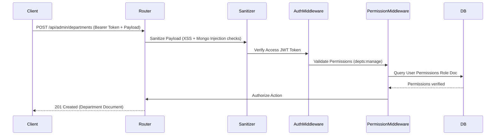

# System Architecture & Technical Specifications

This document outlines the codebase directory structure, database models, security controls, caching mechanisms, and containerized topology of CivicPulse AI.

---

## 📁 System Folder Structure

```
intelligent-self-healing-cicd/
├── jenkins/                      # CI/CD config, scripts, templates, and execution reports
│   ├── config/
│   │   └── pipeline.env          # Centralized environment tuning parameters
│   ├── scripts/                  # Lifecycle scripts (cleanup, deploy, health-check, gitops, self-healing)
│   └── reports/                  # Deployment logs and Trivy security scanner artifacts
├── ml-decision-controller/       # Intelligent Self-Healing Microservice (FastAPI + Kubernetes Client)
│   ├── app/                      # Webhook listener, decision engine, and Kubernetes remediations
│   ├── tests/                    # Microservice unit test suite
│   └── Dockerfile                # Production FastAPI container setup
├── argocd/                       # GitOps Continuous Deployment manifests
│   └── civicpulse-application.yaml # Argo CD Application specification
├── helm/                         # Production Kubernetes Helm chart
│   └── civicpulse/               # CivicPulse AI Helm chart template and values
├── docs/                         # Comprehensive DevOps and API manuals
│   ├── API_DOCUMENTATION.md      # Backend & ML Decision Controller REST API reference
│   ├── ARCHITECTURE.md           # System design & database schemas manual
│   ├── GITOPS_ARGOCD_GUIDE.md    # Argo CD GitOps architecture and workflow guide
│   ├── JENKINS_SETUP.md          # Jenkins installation & plugins guide
│   ├── PIPELINE_ARCHITECTURE.md  # Stage-by-stage pipeline execution guide
│   ├── POLL_SCM_SETUP.md         # Automated SCM polling trigger guide
│   └── self-healing.md           # Self-healing remediation viva demonstration guide
├── backend/                      # Node.js/Express TypeScript API gateway
│   ├── src/
│   │   ├── config/               # Database connection, CORS, rate limiter configs
│   │   ├── constants/            # Role configurations, permission mappings, error messages
│   │   ├── interfaces/           # TypeScript interfaces for models and API payloads
│   │   ├── middleware/           # JWT auth verify, permission guard, security input sanitizers, logging
│   │   ├── models/               # Mongoose schemas (User, Role, Complaint, Department, AuditLog, Conversation, Notification, RefreshToken)
│   │   ├── modules/              # Domain APIs (auth, citizen, complaints, admin, ai-chat, officer, field-worker, notifications)
│   │   ├── repositories/         # Database access repository abstraction layers
│   │   ├── utils/                # JWT, password hashing, winston logger, in-memory cache
│   │   ├── app.ts                # Express application assembly & route registrations
│   │   └── server.ts             # Express server bootstrap & MongoDB connection setup
│   ├── Dockerfile.backend        # Multi-stage production Docker container (Node 22)
│   └── tsconfig.json
├── frontend/                     # Angular 22 standalone web application
│   ├── src/
│   │   ├── app/
│   │   │   ├── core/             # Auth guards, API constant lists, HTTP interceptors
│   │   │   ├── layouts/          # Layout shells (Main navigation sidebar, topbar)
│   │   │   ├── shared/           # Reusable charts, modals, chatbot widget
│   │   │   └── features/         # Feature modules (Citizen Dashboard, Officer Workspace, Field Worker View, Admin Portal)
│   │   ├── styles/               # Modular SCSS stylesheets
│   │   └── index.html
│   ├── Dockerfile.frontend       # Multi-stage production Nginx container (Angular 22)
│   └── nginx.conf                # SPA fallback routing configuration
├── database/                     # MongoDB container configuration
│   └── Dockerfile.mongodb        # Custom MongoDB 8.0 setup
├── nginx/                        # Reverse Proxy & Static Asset Gateway
│   ├── Dockerfile.nginx          # Reverse proxy container setup
│   └── nginx.conf                # Port 80 routing and caching configuration
├── Jenkinsfile                   # Declarative pipeline script (15 stages)
└── docker-compose.yml            # Multi-service local runtime orchestrator
```

---

## 🗄️ Database Schemas & Relations

CivicPulse uses MongoDB with the following Mongoose schemas defined in `backend/src/models`:

### 1. User (`User`)
- Stores credentials, personal info, active roles (`citizen`, `officer`, `field_worker`, `admin`), department bindings, and account lock status (`isLocked`).

### 2. Role & Permissions (`Role`)
- Maps system roles to arrays of permission tags (`USERS_VIEW`, `USERS_MANAGE`, `DEPTS_MANAGE`, `ANALYTICS_VIEW`, `REPORTS_GENERATE`, `AUDIT_VIEW`, `COMPLAINTS_MANAGE`). Seeded on server startup.

### 3. Complaint (`Complaint`)
- Records incidents with title, description, category (Road Damage, Water Supply, Sanitation, Street Lighting, etc.), geo-coordinates, photo attachments, assigned department, assigned field worker, status timeline, and AI copilot analysis metrics.

### 4. Department (`Department`)
- Stores municipal departments (e.g. Public Works, Sanitation, Water Authority), contact info, assigned officers list, and activity metrics.

### 5. Audit Log (`AuditLog`)
- Immutable audit trace storing administrative actions (user account locks, password resets, department modifications, broadcasts) with IP addresses and client user agents.

### 6. Conversation (`Conversation`)
- Stores AI assistant chatbot chat logs (user queries, copilot responses, referenced tickets) keyed by `userId`.

### 7. Notification (`Notification`)
- Stores real-time and broadcast user notifications with read status, priority, and link references.

### 8. Refresh Token (`RefreshToken`)
- Stores hashed JWT refresh tokens keyed by user ID with expiration timestamps for secure token rotation and session revocation.

---

## 🔐 Security & Auth Flow



1. **Dual Token Auth**: Access tokens (15-minute expiry) paired with Refresh tokens (7-day rotation) stored in MongoDB.
2. **Input Sanitization**: Global security sanitizer strips `$` and `.` characters from incoming request body, query params, and parameters to prevent MongoDB operator injection and encodes HTML to neutralize XSS vectors.
3. **Rate Limiting**: Express rate limiters protect the API (`100 requests / 15 minutes` default; `20 requests / 15 minutes` strict limit on `/api/auth/login` and `/api/auth/register`).
4. **RBAC Control**: Route access is guarded by `checkPermission(...)` middleware verifying user role tags against active database role permissions.

---

## ⚡ Performance Caching

CivicPulse implements an in-memory caching utility (`cache.util.ts`):
* **Read-Through**: Frequently queried rosters (such as department listings and role permissions) hit the in-memory cache first. On a cache hit, records return immediately without querying MongoDB.
* **Write-Through Invalidation**: Data alterations (creating/updating departments, assigning/removing officers) automatically trigger targeted cache invalidations, guaranteeing database consistency across microservices.

---

## 🐳 Containerized Service Topology

Managed via `docker-compose.yml`:
1. **`civicpulse-mongodb`**: Custom MongoDB 8.0 database engine listening on port `27017` with persistent named volume `mongodb-data`.
2. **`civicpulse-backend`**: Express API server listening internally on port `3000` mapped to host port `8000`. Dependent on MongoDB health.
3. **`civicpulse-frontend`**: Angular 22 Nginx client container listening internally on port `80` mapped to host port `4200`. Dependent on backend health.
4. **`civicpulse-nginx`**: System reverse proxy listening on host port `80`, routing traffic to frontend and backend services. Dependent on frontend and backend health.
5. **`sonarqube`**: SonarQube Community Edition code analysis server listening on port `9000` with volume persistence for plugins and analysis data.

