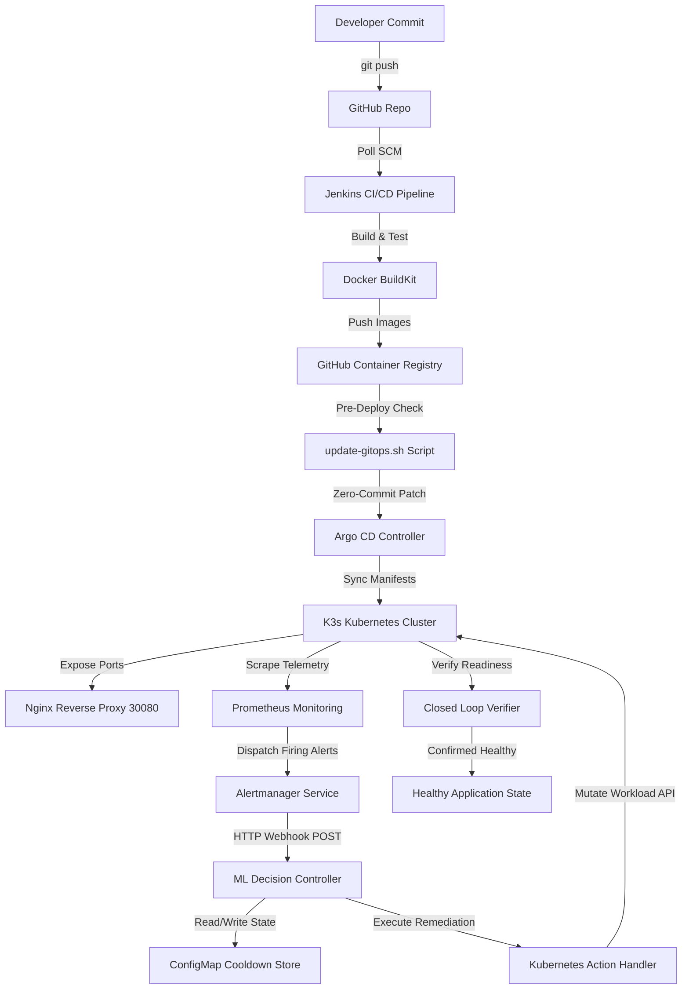

# Intelligent Self-Healing CI/CD Platform with Predictive Monitoring — CivicPulse AI
## Complete Technical Project Walkthrough & Architecture Documentation

---

## 1. Project Overview

### Project Title
**Intelligent Self-Healing CI/CD Platform with Predictive Monitoring — CivicPulse AI**

### Problem Being Solved
Modern cloud-native applications deployed on Kubernetes face frequent runtime anomalies, crash loops, resource exhaustion (CPU/Memory spikes, OOMKills), storage corruption, and bad release rollouts. In traditional DevOps workflows, monitoring systems generate alerts that require human operators to manually investigate, diagnose, execute terminal commands (such as scaling or restarting), and verify recovery. This manual intervention introduces significant Mean Time To Recovery (MTTR), risks human error, and increases operational toil.

### Motivation
CivicPulse AI was built to eliminate manual intervention in routine infrastructure and application failure recovery. By creating a closed-loop autonomous system where monitoring metrics drive real-time predictive decision-making and Kubernetes remediation, the application heals itself within seconds of failure without developer or SRE intervention.

### Objectives
* Automate end-to-end continuous integration, security auditing, containerization, and GitOps deployment.
* Provide continuous observability across application and infrastructure metrics.
* Detect application degradation, crash loops, resource pressure, and deployment failures automatically.
* Compute failure severity and dynamically select targeted remediation actions (`RESTART`, `SCALE`, `ROLLBACK`, `RESOURCE_BOOST`, `STORAGE_REPAIR`).
* Prevent cascading failure loops and alert thrashing using persistent cooldown timers and circuit breakers.
* Execute closed-loop verification to confirm runtime recovery before marking failure resolution as complete.

### Main Idea
CivicPulse AI pairs a full-stack civic management application (Angular frontend, Node.js/Express backend, MongoDB database, Nginx reverse proxy) with an autonomous control loop. Prometheus scrapes metrics, Alertmanager formats firing alerts, and a custom **ML Decision Controller** microservice analyzes alert severity, checks historical failure context, predicts resource exhaustion using linear regression time-series forecasting, triggers Kubernetes API actions, and verifies application health.

### Why Self-Healing CI/CD is Useful
* **Drastic MTTR Reduction:** Solves transient crashes, high load, and failed rollouts in under 60 seconds instead of hours.
* **Autonomous Resilience:** Maintains 24/7 application availability without requiring on-call engineer intervention for known failure modes.
* **Predictive Action:** Scales resources *before* hard failure thresholds are breached, preventing downtime altogether.
* **Safety & Governance:** Protects against infinite healing loops using persistent cooldowns and circuit breakers.

### What Makes CivicPulse AI Different from a Normal CI/CD Pipeline
A standard CI/CD pipeline stops after pushing images and deploying manifests to Kubernetes. If a pod crashes or runs out of memory 10 minutes later, the CI/CD pipeline remains blissfully unaware. 

CivicPulse AI extends CI/CD into a **closed-loop feedback system**:

```
[Developer Commit] → [Jenkins Build/Test/Scan] → [GHCR Push] → [Argo CD GitOps]
                                                                      │
                                                                      ▼
[Healthy App] ◄── [Verification] ◄── [K8s Action] ◄── [ML Controller] ◄── [Prometheus/Alertmanager]
```

### High-Level Workflow
1. **Simple Explanation:** A developer pushes code. Jenkins builds, tests, scans for security flaws, builds Docker images, and pushes them to GHCR. Argo CD deploys the images to K3s Kubernetes. Prometheus watches the application. If the application gets sick (crashes, gets overloaded, or fails an update), Alertmanager notifies the ML Decision Controller. The controller decides the best fix (restart pod, add replicas, or rollback version), executes it on Kubernetes, checks if the app is healthy again, and logs the recovery.
2. **Technical Explanation:** Git push triggers Jenkins Poll SCM. Jenkins executes 13 stages: dependency install, static linting, unit tests with coverage, SonarQube analysis & quality gate, Trivy filesystem security scanning, parallel Docker BuildKit compilation, Trivy container image security gates, multi-attempt image push to GHCR, pre-deployment image manifest verification, pre-deployment cluster health gate, zero-commit Argo CD parameter override patching (`update-gitops.sh`), post-deployment health verification (`health-check.sh`), and monitoring stack verification (`verify-monitoring.sh`). Prometheus scrapes `/metrics` and Kubernetes telemetry; Alertmanager dispatches firing alerts via HTTP POST to `/api/v1/alerts` on the `civicpulse-ml-decision-controller` microservice; the controller computes severity scores, checks `PersistentCooldownStore` (ConfigMap/Redis/Mongo), invokes `KubernetesActionHandler` to execute API mutations, and polls `ClosedLoopVerifier` for pod readiness and HTTP status 200 health responses.

---

## 2. Problem Statement

### Problems with Traditional CI/CD & Kubernetes Deployments
1. **Manual Incident Response:** When a pod enters `CrashLoopBackOff` or encounters memory exhaustion, an engineer must manually inspect `kubectl logs`, diagnose the issue, and manually execute `kubectl rollout restart` or `kubectl scale`.
2. **Post-Deployment Unhandled Failures:** Standard CI/CD tools treat `kubectl apply` or Argo CD sync completion as "success", ignoring runtime failures occurring minutes or hours post-deployment.
3. **Resource Saturation & Unexpected Spikes:** CPU and memory spikes lead to Out-Of-Memory (`OOMKilled`) pod terminations or high latency without proactive auto-expansion.
4. **Bad Release Rollouts:** Deploying an image with broken runtime code or missing environment variables can cause immediate container failures, requiring manual git reverts or manual Argo CD rollbacks.
5. **Monitoring Without Action:** Standard Prometheus and Grafana setups present beautiful graphs and fire Slack/PagerDuty alerts, but do not take programmatic action to repair the cluster.

### How CivicPulse AI Resolves These Problems
* **Automated Remediation:** Replaces manual operator intervention with automated, programmatic Kubernetes API mutations.
* **Predictive Scaling:** Fits linear regression lines to Prometheus metric histories to scale workloads before memory or CPU breach 80-85% alert thresholds.
* **Multi-Tier Escalation:** Moves progressively from simple actions (`RESTART`) to scaling (`SCALE`) to version rollbacks (`ROLLBACK`) based on failure persistence.
* **Governance Guardrails:** Implements persistent cooldown periods (default 300s) and circuit breakers (tripping after 3 consecutive failures) to prevent uncontrolled scaling or infinite restart loops.
* **Closed-Loop Verification:** Mandates that every action is verified via Kubernetes readiness probes and HTTP health endpoints before declaring recovery.

---

## 3. Project Objectives

### CI/CD Objectives (Implemented)
* Automate code checkout, environment variable generation (`generate-env.sh`), and dependency installation (`npm ci`).
* Enforce static code quality with ESLint and Prettier formatting checks.
* Execute unit testing and generate `lcov.info` code coverage reports for both frontend (Vitest) and backend (Jest).
* Run ephemeral MongoDB container (`civicpulse-ci-mongodb`) on port 27017 during CI integration testing.
* Perform SonarQube static analysis and enforce Quality Gate webhook evaluation.
* Scan filesystem and container images using Trivy with strict Quality Gate enforcement (`--exit-code 1` on unfixed HIGH/CRITICAL vulnerabilities).
* Build multi-stage Docker images using BuildKit and push to GitHub Container Registry (`ghcr.io`).
* Execute zero-commit Argo CD parameter overrides updating `backend.image.tag` and `frontend.image.tag` to `${BUILD_NUMBER}`.

### Kubernetes Objectives (Implemented)
* Deploy full application stack on K3s lightweight Kubernetes cluster in namespace `civicpulse`.
* Define deployments, services, ConfigMaps, Secrets, and StatefulSets for Nginx, Frontend, Backend, MongoDB, Prometheus, Grafana, Alertmanager, and ML Decision Controller.
* Expose external ingress traffic via Nginx NodePort `30080`.
* Implement resource requests/limits and Liveness/Readiness HTTP probes across all workloads.

### Monitoring Objectives (Implemented)
* Expose custom Prometheus metrics from Node.js backend using `prom-client` on `/metrics`.
* Scrape application and infrastructure metrics via Prometheus (`v2.52.0`) with a 15-day retention.
* Provide Grafana (`10.4.0`) dashboards for real-time visualization at `/grafana/`.

### Self-Healing Objectives (Implemented)
* Capture firing Prometheus alerts in Alertmanager (`v0.27.0`) and forward to ML Decision Controller webhook endpoint (`/api/v1/alerts`).
* Map alerts to target Kubernetes workloads (`civicpulse-backend`, `civicpulse-mongodb`, `civicpulse-prometheus`, `civicpulse-nginx`, `civicpulse-frontend`, `civicpulse-alertmanager`, `civicpulse-grafana`).
* Execute automated recovery actions (`RESTART`, `SCALE`, `ROLLBACK`, `RESOURCE_BOOST`, `STORAGE_REPAIR`).

### ML / Decision Objectives (Implemented)
* Calculate dynamic severity scores for firing alerts using rule-based scoring weights.
* Maintain multi-tier failure escalation tracking per target workload.
* Apply linear regression forecasting (`y = m*x + c`) over Prometheus metric time-series to trigger proactive scaling.
* Enforce persistent cooldown timers and circuit breaker state machines.

### Verification Objectives (Implemented)
* Validate deployment rollout readiness via Kubernetes AppsV1 API.
* Perform HTTP health probe checks against target service endpoints (`/api/health`, `/-/ready`).
* Verify cluster health via end-to-end verification scripts (`verify-self-healing.sh`).

---

## 4. Technology Stack

| Category | Technology | Purpose |
| :--- | :--- | :--- |
| **Frontend** | Angular 22, TypeScript, SCSS, RxJS | Web UI for civic management portal |
| **Backend** | Node.js, Express, TypeScript | REST API service, authentication, business logic |
| **Database** | MongoDB 8.0, Mongoose | Persistent document store for application data |
| **Reverse Proxy** | Nginx | Single point of entry, request routing, static file server |
| **Containerization** | Docker, Docker Compose, BuildKit | Container engine and parallel multi-stage build tool |
| **CI Automation** | Jenkins (Declarative Pipeline) | Automation server executing build, test, scan, and deploy |
| **Container Registry** | GitHub Container Registry (GHCR) | Private/Public OCI-compliant container image registry |
| **Kubernetes** | K3s (Lightweight Kubernetes) | Container orchestration engine running single-node cluster |
| **GitOps** | Argo CD | Declarative GitOps continuous delivery tool |
| **Monitoring** | Prometheus `v2.52.0`, `prom-client` | Time-series metrics collection and alert evaluation engine |
| **Visualization** | Grafana `10.4.0` | Telemetry dashboards and UI metrics visualization |
| **Alerting** | Alertmanager `v0.27.0` | Alert routing, grouping, and webhook dispatching |
| **Decision Controller** | Python 3.11, FastAPI, Uvicorn | Microservice receiving webhooks, computing decisions, and driving self-healing |
| **Math / ML** | NumPy, SciPy / Linear Regression | Time-series forecasting for predictive resource scaling |
| **K8s Client** | Python `kubernetes` client | Direct API manipulation of Kubernetes resources |
| **Security Scanning** | Trivy | Vulnerability scanner for filesystems and container images |
| **Code Quality** | SonarQube, ESLint, Prettier | Static code analysis, linting, and quality gate enforcement |

---

## 5. Complete Architecture

### Logical Component Flow

```
+-----------------------------------------------------------------------------------+
|                                  DEVELOPER                                        |
+-----------------------------------------------------------------------------------+
                                          │ git push (main / feature)
                                          ▼
+-----------------------------------------------------------------------------------+
|                                GitHub REPOSITORY                                  |
+-----------------------------------------------------------------------------------+
                                          │ Poll SCM (H/15 * * * *) / Webhook
                                          ▼
+-----------------------------------------------------------------------------------+
|                              JENKINS CI/CD PIPELINE                               |
| (Checkout → Validate → Install → Lint → Build → Tests → SonarQube → Trivy Scan)   |
+-----------------------------------------------------------------------------------+
                                          │ Docker BuildKit & Push
                                          ▼
+-----------------------------------------------------------------------------------+
|                        GITHUB CONTAINER REGISTRY (GHCR)                           |
+-----------------------------------------------------------------------------------+
                                          │ Image manifest pull
                                          ▼
+-----------------------------------------------------------------------------------+
|                      ARGO CD GITOPS DEPLOYMENT ENGINE                             |
|           (Patches spec.source.helm.parameters via update-gitops.sh)             |
+-----------------------------------------------------------------------------------+
                                          │ Reconciles cluster state
                                          ▼
+-----------------------------------------------------------------------------------+
|                         K3s KUBERNETES CLUSTER (Namespace: civicpulse)           |
|                                                                                   |
|   +───────────────+   +───────────────+   +───────────────+   +───────────────+   |
|   | Nginx Proxy   |   | Frontend Pod  |   | Backend Pod   |   | MongoDB Pod   |   |
|   | (NodePort     |──►| (Angular)     |──►| (Node.js)     |──►| (StatefulSet) |   |
|   |  30080)       |   |               |   | (/metrics)    |   |               |   |
|   +───────────────+   +───────────────+   +───────────────+   +───────────────+   |
+-----------------------------------------------------------------------------------+
                                          │ Scrapes /metrics & K8s Telemetry
                                          ▼
+-----------------------------------------------------------------------------------+
|                             PROMETHEUS MONITORING                                 |
|                       (Evaluates PrometheusRule Alerts)                           |
+-----------------------------------------------------------------------------------+
                                          │ Dispatches Firing Alerts
                                          ▼
+-----------------------------------------------------------------------------------+
|                             ALERTMANAGER SERVICE                                  |
|               (Routes Webhook to ML Decision Controller)                          |
+-----------------------------------------------------------------------------------+
                                          │ HTTP POST /api/v1/alerts
                                          ▼
+-----------------------------------------------------------------------------------+
|                            ML DECISION CONTROLLER                                 |
|   - Evaluates Alert Severity & Multi-Tier Escalation Level                        |
|   - Checks Persistent Cooldown Store (ConfigMap / Redis / Mongo)                  |
|   - Predicts Resource Trends via Linear Regression                                |
|   - Selects Remediation Action (RESTART | SCALE | ROLLBACK | BOOST | REPAIR)        |
+-----------------------------------------------------------------------------------+
                                          │ Kubernetes Python API Mutation
                                          ▼
+-----------------------------------------------------------------------------------+
|                           KUBERNETES ACTION HANDLER                               |
|        (Patches restartedAt / Replicas / Argo CD App / PVC Storage)               |
+-----------------------------------------------------------------------------------+
                                          │ Polling & Probe Validation
                                          ▼
+-----------------------------------------------------------------------------------+
|                             CLOSED-LOOP VERIFIER                                  |
|       (Verifies Pod Readiness & HTTP 200 Health Probe Endpoint)                  |
+-----------------------------------------------------------------------------------+
                                          │ Confirmed Healthy
                                          ▼
+-----------------------------------------------------------------------------------+
|                          RECOVERED APPLICATION STATE                              |
+-----------------------------------------------------------------------------------+
```

### Component Inter-Communication Table

| Source Component | Destination Component | Protocol / Port | Purpose |
| :--- | :--- | :--- | :--- |
| **Developer** | GitHub | HTTPS / 443 | Source code commits |
| **Jenkins** | GitHub | HTTPS / 443 | Source checkout via Poll SCM |
| **Jenkins** | SonarQube Server | HTTP / 9000 | Upload code scan & wait for Quality Gate |
| **Jenkins** | GHCR | HTTPS / 443 | Push compiled OCI container images |
| **Jenkins** | K3s / Argo CD API | HTTPS / 6443 | Execute `update-gitops.sh` to patch parameter overrides |
| **Argo CD** | K3s Kubernetes API | HTTPS / 6443 | Sync Helm manifests into namespace `civicpulse` |
| **K3s Kubelet** | GHCR | HTTPS / 443 | Pull container images using `ghcr-secret` |
| **User** | Nginx Proxy | HTTP / 30080 | Access CivicPulse AI UI and API |
| **Nginx Proxy** | Frontend Pod | HTTP / 80 | Proxy UI asset requests |
| **Nginx Proxy** | Backend Pod | HTTP / 3000 | Proxy `/api` REST requests |
| **Backend Pod** | MongoDB StatefulSet | TCP / 27017 | Read/Write application database records |
| **Prometheus** | Backend Pod | HTTP / 3000 | Scrape `/metrics` endpoint |
| **Prometheus** | K3s Kubelet / CADVISOR | HTTPS / 10250 | Scrape container CPU/Memory metrics |
| **Prometheus** | Alertmanager | HTTP / 9093 | Send firing alert notifications |
| **Alertmanager** | ML Decision Controller | HTTP / 5000 | Post alert webhook payload to `/api/v1/alerts` |
| **ML Controller** | Prometheus | HTTP / 9090 | Query metric time-series range for predictive scaling |
| **ML Controller** | K3s Kubernetes API | HTTPS / 6443 | Execute workload patch mutations (`restart`, `scale`, `rollback`) |
| **ML Controller** | K3s ConfigMap | HTTPS / 6443 | Persist cooldown state in `civicpulse-cooldown-store` |
| **Closed-Loop Verifier** | Target Application Pods | HTTP / 3000, 80, 5000 | Poll `/api/health` and `/-/ready` endpoints |

---

## 6. Repository Structure

```
intelligent-self-healing-cicd/
├── .gitattributes
├── .gitignore
├── .trivyignore                         # Ignore rules for Trivy security scanner
├── Jenkinsfile                          # Master Declarative Jenkins CI/CD Pipeline (1652 lines)
├── README.md                            # High-level project documentation
├── docker-compose.yml                   # Local container orchestration file
├── package.json                         # Root project configuration
├── sonar-project.properties             # SonarQube analysis configuration
├── argocd/
│   └── civicpulse-application.yaml      # Argo CD Application Custom Resource manifest
├── backend/                             # Node.js Express TypeScript REST API
│   ├── .dockerignore
│   ├── .env.example
│   ├── Dockerfile.backend               # Multi-stage production Docker build
│   ├── eslint.config.mjs
│   ├── package.json
│   ├── tsconfig.json
│   └── src/                             # Backend source code & /metrics endpoint
├── database/                            # MongoDB initialization & Docker build
│   ├── Dockerfile.mongodb               # MongoDB container build
│   └── mongo-init.js                    # Database seed script
├── docs/                                # Technical architecture and API guides
│   ├── API_DOCUMENTATION.md
│   ├── ARCHITECTURE.md
│   ├── GITOPS_ARGOCD_GUIDE.md
│   ├── JENKINS_SETUP.md
│   ├── PIPELINE_ARCHITECTURE.md
│   ├── POLL_SCM_SETUP.md
│   └── self-healing.md
├── frontend/                            # Angular 19 Web Application
│   ├── Dockerfile.frontend              # Multi-stage build (Node build -> Nginx runtime)
│   ├── angular.json
│   ├── nginx.conf                       # Frontend container Nginx config
│   ├── package.json
│   ├── proxy.conf.json
│   └── src/                             # Angular source components, styles, and tests
├── helm/
│   └── civicpulse/                      # Master Helm Chart for entire stack
│       ├── Chart.yaml
│       ├── values.yaml                  # Default Helm configuration & fallback image tags
│       └── templates/                   # Kubernetes manifest templates
│           ├── _helpers.tpl
│           ├── alertmanager-deployment.yaml
│           ├── alertmanager-service.yaml
│           ├── backend-deployment.yaml
│           ├── backend-service.yaml
│           ├── frontend-deployment.yaml
│           ├── frontend-service.yaml
│           ├── grafana-dashboards-configmap.yaml
│           ├── grafana-deployment.yaml
│           ├── grafana-service.yaml
│           ├── ingress.yaml
│           ├── ml-decision-controller-deployment.yaml
│           ├── ml-decision-controller-rbac.yaml
│           ├── ml-decision-controller-service.yaml
│           ├── mongodb-service.yaml
│           ├── mongodb-statefulset.yaml
│           ├── monitoring-secret.yaml
│           ├── namespace.yaml
│           ├── nginx-configmap.yaml
│           ├── nginx-deployment.yaml
│           ├── nginx-service.yaml
│           ├── prometheus-deployment.yaml
│           ├── prometheus-rbac.yaml
│           ├── prometheus-service.yaml
│           └── secret.yaml
├── jenkins/                             # Jenkins scripts, templates, and reports
│   ├── Jenkinsfile.security-audit
│   ├── reports/                         # Trivy, Sonar, and Monitoring report outputs
│   ├── scripts/                         # Automation bash scripts
│   │   ├── cleanup.sh
│   │   ├── deploy.sh
│   │   ├── generate-env.sh
│   │   ├── generate-monitoring-report.sh
│   │   ├── generate-report.sh
│   │   ├── health-check.sh
│   │   ├── mongo-ci.sh
│   │   ├── pre-deploy-self-heal.sh
│   │   ├── trivy-init-db.sh
│   │   ├── update-gitops.sh
│   │   ├── verify-monitoring.sh
│   │   └── verify-self-healing.sh
│   └── templates/
│       └── html.tpl                     # HTML template for Trivy vulnerability reports
├── ml-decision-controller/              # Autonomous Self-Healing Decision Microservice
│   ├── Dockerfile                       # Python 3.11 Slim container build
│   ├── README.md
│   ├── requirements.txt                 # FastAPI, Uvicorn, Kubernetes, NumPy dependencies
│   ├── app/
│   │   ├── __init__.py
│   │   ├── cooldown_store.py            # Multi-backend persistent cooldown & circuit store
│   │   ├── decision_engine.py           # Core severity scoring & decision logic
│   │   ├── main.py                      # FastAPI Webhook API server
│   │   ├── models.py                    # Pydantic data schemas
│   │   ├── predictor.py                 # Linear regression predictive scaling engine
│   │   ├── verifier.py                  # Closed-loop runtime verification handler
│   │   └── kubernetes/
│   │       ├── __init__.py
│   │       └── actions.py               # Kubernetes API action executor
│   └── tests/                           # Controller unit tests
└── nginx/                               # System Reverse Proxy
    ├── Dockerfile.nginx
    └── nginx.conf                       # Main reverse proxy configuration
```

---

## 7. Application Architecture

### Frontend
* **Framework:** Angular 22 (TypeScript, SCSS, RxJS).
* **Build Process:** Compiled via `npm run build -- --configuration production` into static assets under `dist/`.
* **Container Environment:** Multi-stage Docker build (`frontend/Dockerfile.frontend`). Stage 1 compiles Angular using Node.js 22; Stage 2 serves assets using `nginx:alpine`.
* **Port:** Container internal port 80. Exposed via Service `civicpulse-frontend` on port 80.
* **Backend Communication:** Communicates with the backend REST API via relative `/api` paths routed through the Nginx reverse proxy.

### Backend
* **Runtime/Framework:** Node.js 22, Express, TypeScript.
* **APIs & Features:** REST API endpoints handling authentication (JWT Access & Refresh tokens), user management, civic issue reporting, system health checks (`/api/health`), and Prometheus metrics export (`/metrics`).
* **Container Environment:** Multi-stage Docker build (`backend/Dockerfile.backend`). Stage 1 builds TypeScript to JavaScript (`dist/`); Stage 2 runs production Node server.
* **Port:** Container internal port 3000. Service `civicpulse-backend` exposes port 3000.
* **Database Communication:** Connects to MongoDB via Mongoose using the connection URI `mongodb://mongodb:27017/civicpulse` (or `mongodb://civicpulse-mongodb:27017/civicpulse` in Kubernetes).
* **Metrics Endpoint:** Integrates `prom-client` to record HTTP request latencies, status codes, process memory, CPU utilization, and custom business metrics exposed at `GET /metrics`.

### MongoDB
* **Purpose:** Primary NoSQL document database storing application domain data.
* **Deployment Method:** Deployed as a Kubernetes `StatefulSet` (`civicpulse-mongodb`) with 1 replica to ensure stable network identity and storage binding.
* **Persistence:** Uses PersistentVolumeClaim (PVC) requesting 1Gi `ReadWriteOnce` storage.

### Nginx Reverse Proxy
* **Purpose:** Central entry point for external client traffic.
* **Deployment Method:** Kubernetes Deployment (`civicpulse-nginx`) paired with a `NodePort` Service exposing port `30080`.
* **Routing Behavior:**
  * Requests matching `/` are proxied to `http://civicpulse-frontend:80`.
  * Requests matching `/api/` are proxied to `http://civicpulse-backend:3000`.
  * Requests matching `/grafana/` are proxied to `http://civicpulse-grafana:3000`.
  * Requests matching `/health` return HTTP 200 `OK`.

```
User / Client
      │
      ▼
Nginx Reverse Proxy (NodePort 30080)
      │
      ├───────────────────────────────┬───────────────────────────────┐
      ▼                               ▼                               ▼
Frontend Pod (Port 80)        Backend Pod (Port 3000)        Grafana Pod (Port 3000)
(Angular Static Assets)        (Node.js REST API & /metrics)   (Monitoring Dashboard)
                                      │
                                      ▼
                             MongoDB StatefulSet (Port 27017)
```

---

## 8. Docker Architecture

### Analysis of Dockerfiles

#### 1. Backend (`backend/Dockerfile.backend`)
```dockerfile
# Stage 1: Build
FROM node:20-alpine AS builder
WORKDIR /app
COPY package*.json ./
RUN npm ci
COPY . .
RUN npm run build

# Stage 2: Runtime
FROM node:20-alpine AS runner
WORKDIR /app
NODE_ENV=production
COPY package*.json ./
RUN npm ci --only=production
COPY --from=builder /app/dist ./dist
EXPOSE 3000
CMD ["node", "dist/index.js"]
```
* **Base Image:** `node:20-alpine` (lightweight, minimal attack surface).
* **Build Optimization:** Multi-stage build separates TypeScript compiler dependencies from the lean production runtime image, reducing final image size.

#### 2. Frontend (`frontend/Dockerfile.frontend`)
```dockerfile
# Stage 1: Build
FROM node:20-alpine AS builder
WORKDIR /app
COPY package*.json ./
RUN npm ci
COPY . .
RUN npm run build -- --configuration production

# Stage 2: Production Web Server
FROM nginx:alpine AS runner
COPY --from=builder /app/dist/frontend/browser /usr/share/nginx/html
COPY nginx.conf /etc/nginx/conf.d/default.conf
EXPOSE 80
CMD ["nginx", "-g", "daemon off;"]
```
* **Runtime:** `nginx:alpine` serving compiled Angular static bundles.

#### 3. ML Decision Controller (`ml-decision-controller/Dockerfile`)
```dockerfile
FROM python:3.11-slim
WORKDIR /app
COPY requirements.txt .
RUN pip install --no-cache-dir -r requirements.txt
COPY app ./app
EXPOSE 5000
CMD ["uvicorn", "app.main:app", "--host", "0.0.0.0", "--port", "5000"]
```
* **Dependencies:** `fastapi`, `uvicorn`, `kubernetes`, `pydantic`, `httpx`, `prometheus_client`, `numpy`.

#### 4. Database & Reverse Proxy (`database/Dockerfile.mongodb`, `nginx/Dockerfile.nginx`)
* Custom Dockerfiles deriving from `mongo:8.0` and `nginx:alpine` incorporating initial seed scripts (`mongo-init.js`) and custom routing configuration (`nginx.conf`).

### Key Docker Concepts Explained
* **Docker Build:** The compilation process where Docker reads a `Dockerfile`, executes steps sequentially, and packages output layers into an image artifact.
* **Docker Image:** An immutable, read-only template containing application code, runtime libraries, environment variables, and filesystem layers.
* **Docker Container:** A runnable, isolated instance of a Docker image executing as a process on the host kernel.
* **Docker Registry:** A centralized repository service (GHCR) used to store, tag, version, and distribute container images.

---

## 9. Jenkins CI/CD Pipeline — Stage-by-Stage

The Jenkins pipeline is defined declaratively in `Jenkinsfile` (1652 lines). Below is the stage-by-stage technical breakdown:

### STAGE 1 — Checkout Source Code
* **Purpose:** Clean workspace and retrieve latest source code from Git SCM.
* **Commands/Scripts:** `cleanWs()`, `checkout scm`, git commit metadata extraction via `git rev-parse` and `git log`.
* **Input:** Git repository URL and target branch (`params.BRANCH_NAME`).
* **Output:** Cleaned workspace populated with code; environment variables `GIT_COMMIT_SHORT`, `GIT_AUTHOR`, `IMAGE_TAG` (`${BUILD_NUMBER}`) set.
* **Failure Behavior:** Aborts pipeline immediately if repository check fails or required files (`docker-compose.yml`, `package.json`) are missing.

### STAGE 2 — Environment Validation
* **Purpose:** Verify required system CLI binaries (`docker`, `docker compose`, `git`, `node`, `npm`) and generate missing `.env` files.
* **Commands/Scripts:** Executes `jenkins/scripts/generate-env.sh`. Checks presence of `backend/Dockerfile.backend`, `frontend/Dockerfile.frontend`, etc.
* **Failure Behavior:** Increments `ERRORS` counter and aborts pipeline with exit code 1 if prerequisites fail.

### STAGE 3 — Install Dependencies (Parallel)
* **Purpose:** Deterministically install Node.js npm packages for frontend and backend.
* **Commands/Scripts:** `dir('backend') { npm ci --prefer-offline }` and `dir('frontend') { npm ci --prefer-offline }` in parallel.
* **Output:** Hydrated `node_modules` directories in both packages.

### STAGE 4 — Static Code Validation (Parallel)
* **Purpose:** Run ESLint code quality rules on TypeScript backend files and Prettier format checks on frontend code.
* **Commands/Scripts:** `npx eslint src/**/*.ts` and `npx prettier --check "src/**/*.{ts,html,scss}"`.
* **Failure Behavior:** Warns on lint/formatting discrepancies without breaking the build (unless strict errors are raised). Skips if `params.SKIP_TESTS` is true.

### STAGE 5 — Build Application (Parallel)
* **Purpose:** Compile TypeScript backend into JavaScript and build production Angular frontend.
* **Commands/Scripts:** `npm run build` (Backend) and `npm run build -- --configuration production` (Frontend).
* **Output:** Compiled assets in `backend/dist/` and `frontend/dist/`. Archived as Jenkins artifacts.

### STAGE 5.5 — Unit Tests & Code Coverage (Parallel)
* **Purpose:** Execute unit tests and generate `lcov.info` coverage reports.
* **Commands/Scripts:**
  * **Backend:** Spins up transient MongoDB container (`civicpulse-ci-mongodb`) on `127.0.0.1:27017`, runs `npm test`, verifies `coverage/lcov.info`, and tears down container in post block.
  * **Frontend:** Runs `npm test`, generating `frontend/coverage/lcov.info`.
* **Failure Behavior:** Fails pipeline if `lcov.info` report files fail to generate.

### STAGE 6 — SonarQube Analysis
* **Purpose:** Submit code and LCOV coverage metrics to SonarQube server for deep static security and debt analysis.
* **Commands/Scripts:** Wraps execution in `withSonarQubeEnv('SonarQube')` and invokes system `sonar-scanner` CLI reading `sonar-project.properties`.

### STAGE 7 — SonarQube Quality Gate
* **Purpose:** Wait for SonarQube server webhook evaluation.
* **Commands/Scripts:** `waitForQualityGate()`.
* **Failure Behavior:** Logs status. In case of timeout or failure, logs warnings and permits execution to continue for demonstration continuity.

### STAGE 8 — Trivy Filesystem Scan
* **Purpose:** Scan workspace filesystem for known vulnerabilities (CVEs) and secret leaks.
* **Commands/Scripts:** Executes `jenkins/scripts/trivy-init-db.sh` to load cached DB. Runs `trivy fs` producing JSON, SARIF, and HTML reports (`trivy-fs-report.html`). Runs strict quality gate: `trivy fs --severity HIGH,CRITICAL --ignore-unfixed --exit-code 1 .`.
* **Failure Behavior:** Fails build if unfixed HIGH or CRITICAL vulnerabilities exist in project code dependencies.

### STAGE 9 — Docker Build
* **Purpose:** Compile container images for all microservices using Docker BuildKit.
* **Commands/Scripts:** Sets `DOCKER_BUILDKIT=1`, `COMPOSE_DOCKER_CLI_BUILD=1`, `IMAGE_TAG="${env.BUILD_NUMBER}"`. Runs `docker compose build --parallel`.
* **Output:** Local images `civicpulse/backend:${BUILD_NUMBER}`, `civicpulse/frontend:${BUILD_NUMBER}`, `civicpulse/nginx:${BUILD_NUMBER}`, `civicpulse/mongodb:${BUILD_NUMBER}`, `civicpulse/ml-decision-controller:${BUILD_NUMBER}`.

### STAGE 10 — Trivy Image Scan
* **Purpose:** Vulnerability scan of built container images.
* **Commands/Scripts:** Iterates over images executing `trivy image --severity HIGH,CRITICAL --ignore-unfixed --exit-code 1 <image>`. Produces per-image JSON/SARIF/HTML reports in `jenkins/reports/trivy/`.
* **Failure Behavior:** Hard failure (`error(...)`) if unpatched HIGH/CRITICAL OS or application layer vulnerabilities are discovered.

### STAGE 10.5 — Push Images to GHCR
* **Purpose:** Tag and push built images to GitHub Container Registry (`ghcr.io`).
* **Commands/Scripts:** Authenticates via `withCredentials` using `ghcr-credentials`. Tags images with `${BUILD_NUMBER}` and `latest`. Includes exponential backoff retry function `push_with_retry` (up to 5 attempts) to handle transient network timeouts.
* **Output:** Published images in `ghcr.io/tharunadhithyaa/civicpulse-*:${BUILD_NUMBER}`.

### STAGE 10.6 — Pre-Deployment Image Verification
* **Purpose:** Verify image availability in GHCR *before* making cluster changes.
* **Commands/Scripts:** Performs HTTP Registry API manifest checks (`/v2/<repo>/manifests/<tag>`) and fallback `docker manifest inspect`.
* **Failure Behavior:** Aborts deployment immediately if target build image manifest is missing in GHCR.

### STAGE 10.7 — Pre-Deployment Cluster Health Gate
* **Purpose:** Assess existing cluster health prior to deployment.
* **Commands/Scripts:** Executes `jenkins/scripts/pre-deploy-self-heal.sh --mode pre --fresh-images-pushed`.

### STAGE 11 — Deploy via Argo CD
* **Purpose:** Execute zero-commit parameter override deployment to Argo CD.
* **Commands/Scripts:** Executes `jenkins/scripts/update-gitops.sh --build-number ${BUILD_NUMBER}`. Patches Argo CD Application resource parameters (`backend.image.tag` & `frontend.image.tag`), triggers Argo CD refresh, and waits for K3s workload rollout completion.

### STAGE 12 — Health Verification
* **Purpose:** Post-deployment cluster health gate and application endpoint polling.
* **Commands/Scripts:** Executes `pre-deploy-self-heal.sh --mode post` followed by `jenkins/scripts/health-check.sh` polling application NodePort `30080` endpoints.

### STAGE 12.5 & 12.6 — Deploy & Verify Monitoring Stack
* **Purpose:** Confirm Prometheus, Grafana, and Alertmanager readiness.
* **Commands/Scripts:** Executes `jenkins/scripts/verify-monitoring.sh`. Checks Grafana UI accessibility at `/grafana/`.

### STAGE 12.7 — Verify ML Decision Controller
* **Purpose:** Test ML Decision Controller availability and trigger self-healing verification suite.
* **Commands/Scripts:** Queries `http://localhost:5000/health` inside ML controller pod and runs `jenkins/scripts/verify-self-healing.sh`.

### STAGE 13 & 13.5 — Deployment & Monitoring Reports
* **Purpose:** Consolidate build metadata, test coverage, Trivy vulnerability outputs, and deployment status into HTML reports archived as Jenkins build artifacts.

---

## 10. Jenkins Pipeline Execution Flow

```
1. Jenkins Poll SCM Trigger (or Manual Trigger with parameters)
   │
2. Workspace Cleanup & Source Checkout (Git commit & build number initialized)
   │
3. Environment Validation (Generating missing .env files & validating CLI dependencies)
   │
4. Parallel Dependency Installation (npm ci for Backend & Frontend)
   │
5. Parallel Static Code Validation (ESLint & Prettier checks)
   │
6. Parallel Application Build (Backend TypeScript compilation & Frontend Angular prod build)
   │
7. Parallel Unit Testing & Coverage Generation (MongoDB CI container + Jest & Vitest lcov.info)
   │
8. SonarQube Static Analysis & Quality Gate Webhook Wait
   │
9. Trivy Filesystem Vulnerability Scan (Cached DB + Quality Gate enforcement)
   │
10. Docker BuildKit Parallel Container Build (Tagged with BUILD_NUMBER)
   │
11. Trivy Container Image Security Gate (Scanning 5 microservice images)
   │
12. Authenticated Push to GHCR (Multi-attempt retry loop with exponential backoff)
   │
13. Pre-Deployment GHCR Image Manifest Verification (HTTP Registry API inspection)
   │
14. Pre-Deployment Cluster Health & Self-Healing Gate
   │
15. Zero-Commit Argo CD Deployment Trigger (update-gitops.sh parameter override patch)
   │
16. Kubernetes Deployment Rollout & Pod Readiness Wait
   │
17. Health Verification Gate (health-check.sh endpoint polling)
   │
18. Monitoring Stack Verification (verify-monitoring.sh)
   │
19. ML Decision Controller Verification (verify-self-healing.sh)
   │
20. Report Archival & Pipeline Success Summary
```

---

## 11. GitHub and Branch Strategy

* **Repository:** `https://github.com/tharunadhithyaa/intelligent-self-healing-cicd.git`
* **Primary Branch:** `main` (Contains source code, Helm chart base configuration, and pipeline definitions).
* **GitOps Branch Behavior in Current Implementation:**
  * To avoid triggering infinite Jenkins build loops caused by git commits back to `main`, the project utilizes a **Zero-Commit GitOps Deployment Strategy**.
  * Jenkins does **NOT** create git commits or push modified `values.yaml` files during build execution.
  * Instead, `jenkins/scripts/update-gitops.sh` uses `kubectl patch application civicpulse -n argocd` to apply live parameter overrides directly to the Argo CD Custom Resource:
    ```json
    {
      "spec": {
        "source": {
          "helm": {
            "parameters": [
              {"name": "frontend.image.tag", "value": "447"},
              {"name": "backend.image.tag", "value": "447"}
            ]
          }
        }
      }
    }
    ```
  * Argo CD detects these parameter overrides immediately, overrides the default tags in `values.yaml`, and syncs the K3s cluster.

---

## 12. Container Registry — GHCR

* **Registry Base URL:** `ghcr.io`
* **Namespace / Owner:** `tharunadhithyaa`
* **Image Naming Scheme:**
  * `ghcr.io/tharunadhithyaa/civicpulse-backend:${BUILD_NUMBER}`
  * `ghcr.io/tharunadhithyaa/civicpulse-frontend:${BUILD_NUMBER}`
  * `ghcr.io/tharunadhithyaa/civicpulse-ml-decision-controller:${BUILD_NUMBER}`
  * `ghcr.io/tharunadhithyaa/civicpulse-nginx:latest`
  * `ghcr.io/tharunadhithyaa/civicpulse-mongodb:latest`
* **Authentication Mechanism:**
  * Jenkins authenticates using credentials ID `ghcr-credentials` (`GHCR_USERNAME` / `GHCR_TOKEN`).
  * Kubernetes nodes pull images using Kubernetes imagePullSecret `ghcr-secret` generated dynamically in namespace `civicpulse`.

---

## 13. Argo CD GitOps Deployment

* **Argo CD Application Name:** `civicpulse`
* **Target Namespace:** `civicpulse`
* **Application Spec:**
  * **Repo URL:** `https://github.com/tharunadhithyaa/intelligent-self-healing-cicd.git`
  * **Target Revision:** `main`
  * **Path:** `helm/civicpulse`
* **Automated Sync Policy:**
  * `prune: true` (Removes resources no longer defined in Helm).
  * `selfHeal: true` (Automatically reverts out-of-band manual changes unless overridden).
* **Sync Options:** `CreateNamespace=true`, `ApplyOutOfSyncOnly=true`, `RespectIgnoreDifferences=true`.

---

## 14. Kubernetes / K3s Architecture

* **Cluster Environment:** K3s lightweight Kubernetes running on host node IP `172.17.184.54`.
* **Namespace:** `civicpulse` (App & Monitoring), `argocd` (Argo CD controller).
* **Deployed Workloads & Resources:**
  * **Deployments:** `civicpulse-frontend` (1 replica), `civicpulse-backend` (1-3 replicas), `civicpulse-nginx` (1 replica), `civicpulse-prometheus` (1 replica), `civicpulse-grafana` (1 replica), `civicpulse-alertmanager` (1 replica), `civicpulse-ml-decision-controller` (1 replica).
  * **StatefulSets:** `civicpulse-mongodb` (1 replica, PVC 1Gi).
  * **Services:** `civicpulse-nginx` (NodePort 30080), `civicpulse-backend` (ClusterIP 3000), `civicpulse-frontend` (ClusterIP 80), `civicpulse-mongodb` (ClusterIP 27017), `civicpulse-prometheus` (ClusterIP 9090), `civicpulse-grafana` (ClusterIP 3000), `civicpulse-alertmanager` (ClusterIP 9093), `civicpulse-ml-decision-controller` (ClusterIP 5000).
  * **ConfigMaps:** `nginx-configmap`, `grafana-dashboards-configmap`, `civicpulse-cooldown-store`.
  * **Secrets:** `civicpulse-secret` (JWT keys & passwords), `ghcr-secret` (Registry auth), `civicpulse-grafana-secret`.
  * **RBAC:** `prometheus-clusterrole`, `prometheus-clusterrolebinding`, `ml-decision-controller-clusterrole`, `ml-decision-controller-clusterrolebinding`.

---

## 15. Helm Architecture

### Chart Structure (`helm/civicpulse/`)
* `Chart.yaml`: Defines chart name `civicpulse`, version `1.0.0`, and appVersion `2.0.0`.
* `values.yaml`: Base default configuration containing image repositories, fallback tags, port allocations, resource requests/limits, monitoring toggles, and secret keys.
* `templates/`: Modular Kubernetes YAML templates parameterized via Helm templating language.

```yaml
# Sample snippet from helm/civicpulse/templates/backend-deployment.yaml
spec:
  replicas: {{ .Values.backend.replicaCount }}
  template:
    spec:
      containers:
        - name: backend
          image: "{{ .Values.backend.image.repository }}:{{ .Values.backend.image.tag }}"
```

---

## 16. Monitoring Architecture

```
+------------------------------------+
| CivicPulse AI Backend & Workloads  |
|      (Exposes GET /metrics)        |
+------------------------------------+
                  │
                  │ Scraped every 15s
                  ▼
+------------------------------------+
|        Prometheus Server           |
|  - Stores time-series data (15d)   |
|  - Evaluates Alerting Rules        |
+------------------------------------+
                  │
                  │ Firing Alert Payload
                  ▼
+------------------------------------+
|       Alertmanager Service         |
|  - Groups & deduplicates alerts    |
|  - Dispatches HTTP Webhook         |
+------------------------------------+
                  │
                  │ HTTP POST /api/v1/alerts
                  ▼
+------------------------------------+
|       ML Decision Controller       |
+------------------------------------+
```

---

## 17. Prometheus Metrics

The backend exposes Node.js runtime and custom business metrics at `/metrics` using `prom-client`:
* `http_request_duration_seconds` (Histogram): Request latency tracking.
* `http_requests_total` (Counter): Total HTTP requests by path and status code.
* `process_cpu_seconds_total` (Counter): CPU utilization.
* `process_resident_memory_bytes` (Gauge): Resident memory consumption.
* `mongodb_connected` (Gauge): 1 if connected to MongoDB, 0 otherwise.

Prometheus scrapes these metrics every 15 seconds.

---

## 18. Alerting System

Configured Prometheus alert rules in `prometheus-deployment.yaml`:

| Alert Name | Severity | Condition / PromQL | Description |
| :--- | :--- | :--- | :--- |
| **PodCrashLooping** | Critical | `rate(kube_pod_container_status_restarts_total[5m]) > 0` | Pod container restarting repeatedly |
| **BackendHealthFailing** | Critical | `probe_success{job="backend"} == 0` or HTTP status != 200 | Backend health endpoint failing |
| **MongoDBDown** | Critical | `mongodb_connected == 0` | Backend lost database connectivity |
| **OOMKilled** | Critical | `kube_pod_container_status_last_terminated_reason{reason="OOMKilled"} == 1` | Container terminated due to memory exhaustion |
| **ImagePullBackOff** | Critical | `kube_pod_container_status_waiting_reason{reason="ImagePullBackOff"} == 1` | Kubelet unable to pull container image |
| **ErrImagePull** | Critical | `kube_pod_container_status_waiting_reason{reason="ErrImagePull"} == 1` | Container image repository error |
| **HighCpuUsage** | Warning | `rate(container_cpu_usage_seconds_total[5m]) > 0.80` | CPU utilization exceeds 80% |
| **HighMemoryUsage** | Warning | `container_memory_working_set_bytes > 400MB` | Memory working set exceeds 400MB |
| **PrometheusCrashLooping**| Critical | `rate(kube_pod_container_status_restarts_total{pod=~".*prometheus.*"}[5m]) > 0` | Prometheus server crashing (storage corruption) |

---

## 19. Alertmanager Flow

When a rule fires in Prometheus:
1. Prometheus marks alert as `FIRING` and sends JSON payload to Alertmanager on port `9093`.
2. Alertmanager groups alerts by `alertname` and `namespace`.
3. Alertmanager executes webhook receiver routing payload via HTTP POST to:
   `http://civicpulse-ml-decision-controller:5000/api/v1/alerts`

---

## 20. ML Decision Controller

The ML Decision Controller is a FastAPI microservice running on Python 3.11.

### Decision Engine & Severity Scoring
The controller evaluates incoming alerts using a heuristic severity matrix (`ALERT_SEVERITY_SCORES`):
* `OOMKilled`: 12.0
* `MongoDBDown`: 12.0
* `PodCrashLooping`: 10.0
* `BackendHealthFailing`: 10.0
* `ImagePullBackOff`: 15.0
* `HighCpuUsage`: 6.0
* `HighMemoryUsage`: 6.0

### Multi-Tier Escalation Logic
The engine tracks consecutive failure counts (`failure_count`) per target workload:
1. **Tier 1 (First Failure / `failure_count == 0`):** Triggers `RESTART` action (rollout restart).
2. **Tier 2 (Second Failure / `failure_count == 1` or High CPU):** Escalates to `SCALE` action (increases replicas by +1 up to max 3).
3. **Tier 3 (Third Failure / `failure_count == 2` or `total_score >= 20.0`):** Escalates to `ROLLBACK` action (reverts image tag in Argo CD).
4. **Special Action — `RESOURCE_BOOST`:** Triggered directly on `OOMKilled` events, boosting container memory limit to 1Gi.
5. **Special Action — `STORAGE_REPAIR`:** Triggered on persistent `PrometheusCrashLooping`, executing transient pod cleanup of corrupted TSDB WAL files.
6. **Circuit Breaker Trip (`failure_count >= 3`):** Moves circuit breaker state to `OPEN`, blocking further automated mutations (`NONE`) to prevent infinite failure loops.

*Note on Machine Learning:* The decision engine uses rule-based heuristic scoring and dynamic state-machine escalation for reactive alerts, combined with linear regression time-series forecasting (`fit_linear_trend` in `predictor.py`) for predictive resource scaling.

---

## 21. Self-Healing Mechanism

```
[Failure Occurs]
      │
      ▼
[Prometheus Detects Metric Anomaly]
      │
      ▼
[Alert Rule Fires]
      │
      ▼
[Alertmanager Dispatches Webhook]
      │
      ▼
[ML Decision Controller Receives Payload]
      │
      ▼
[Decision Engine Evaluates Severity & Escalation Tier]
      │
      ├───────────────────────┬───────────────────────┬───────────────────────┐
      ▼                       ▼                       ▼                       ▼
  [RESTART]                [SCALE]                [ROLLBACK]          [RESOURCE_BOOST]
(Patch restartedAt)   (Scale Replicas +1)    (Patch Argo Tag)     (Increase Mem Limit)
      │                       │                       │                       │
      └───────────────────────┴───────────┬───────────┴───────────────────────┘
                                          │
                                          ▼
                             [Kubernetes API Execution]
                                          │
                                          ▼
                            [Closed-Loop Runtime Verifier]
                                          │
                  ┌───────────────────────┴───────────────────────┐
                  ▼                                               ▼
         (Verification PASSED)                           (Verification FAILED)
                  │                                               │
         - Reset failure count                           - Increment failure count
         - Record action time                            - Check Circuit Breaker (Max 3)
         - Log SUCCESS audit                             - Escalate to next tier
```

---

## 22. RESTART Self-Healing

* **Trigger:** `PodCrashLooping` or `BackendHealthFailing` alert at Tier 1.
* **Mechanism:** Updates deployment annotation:
  `spec.template.metadata.annotations["kubectl.kubernetes.io/restartedAt"] = <ISO_TIMESTAMP>`
* **Kubernetes Reaction:** Kubernetes Deployment controller initiates a rolling update, spawning new pods and terminating old ones.
* **Readiness Check:** Polled until new pods pass Liveness/Readiness probes.

---

## 23. SCALE Self-Healing

* **Trigger:** `HighCpuUsage`, `HighMemoryUsage`, or Tier 2 persistent failures.
* **Mechanism:** Queries current deployment replica count and patches `spec.replicas = min(current + 1, 3)`.
* **Guardrails:** Capped at `max_replicas = 3` to prevent cluster resource exhaustion.

---

## 24. ROLLBACK Self-Healing

* **Trigger:** `RollbackRequired`, invalid image alerts (`ErrImagePull`), or Tier 3 failure escalation.
* **Mechanism:** Patches Argo CD Application Custom Resource parameters (`backend.image.tag` & `frontend.image.tag`) targeting the previous numeric build tag (e.g. `${BUILD_NUMBER} - 1`).
* **Result:** Argo CD syncs the cluster back to the last known working container image tags.

---

## 25. Cooldown / Governance

* **Purpose:** Prevents alert thrashing, race conditions, and rapid duplicate actions.
* **Default Cooldown Period:** 300 seconds (5 minutes) per action target.
* **Persistent Cooldown Store (`app/cooldown_store.py`):**
  * Pluggable backend storage supporting:
    1. **Kubernetes ConfigMap:** Stores JSON state in `civicpulse-cooldown-store` with optimistic locking (`resourceVersion`).
    2. **Redis:** Key-value storage if `REDIS_URL` is present.
    3. **MongoDB:** Persistent collection if `MONGODB_URI` is present.
    4. **Memory:** Fallback in-memory dictionary.
* **Circuit Breaker:** Opens after 3 consecutive verification failures, pausing auto-healing for that workload. Reset via `POST /api/v1/circuit-breaker/reset`.

---

## 26. Self-Healing Verification

`ClosedLoopVerifier` (`app/verifier.py`) enforces a two-step post-action verification:
1. **Kubernetes Rollout Verification:** Polls `AppsV1Api` for up to 90 seconds until `ready_replicas >= desired_replicas` and `updated_replicas >= desired_replicas`.
2. **HTTP Endpoint Health Verification:** Issues HTTP GET requests against service health endpoints (`http://civicpulse-backend:3000/api/health`). Requires HTTP 200/204 response.

If both pass, the failure counter resets to 0. If either fails, failure count increments, accelerating escalation.

---

## 27. Self-Healing Test Cases

Automated test cases executed by `jenkins/scripts/verify-self-healing.sh`:

| Test | Failure Scenario | Expected Decision | Kubernetes Action | Expected Verification Result |
| :--- | :--- | :--- | :--- | :--- |
| **Test 1** | `PodCrashLooping` alert fired | `RESTART` | Patch `kubectl.kubernetes.io/restartedAt` | `restartedAt` timestamp updated, new pod ready |
| **Test 2** | `HighCpuUsage` alert fired | `SCALE` | Patch `spec.replicas` from 1 to 2 | Replicas increased to 2, both pods ready |
| **Test 3** | `RollbackRequired` alert fired | `ROLLBACK` | Patch Argo CD parameters to previous build tag | Application tag patched, rollout healthy |
| **Test 4** | Immediate duplicate alert payload | `NONE` (Cooldown) | Action blocked by `PersistentCooldownStore` | Decision returns `cooldown_active: true`, zero K8s mutations |

---

## 28. End-to-End Failure Scenario — Unhealthy Backend

1. **Failure:** Backend process enters deadlock or unhandled exception state; `/api/health` returns HTTP 500.
2. **Detection:** Prometheus scrapes `/metrics` / probe fails; `BackendHealthFailing` rule fires after 15s.
3. **Alert Dispatch:** Alertmanager formats alert payload and sends POST to ML Decision Controller `/api/v1/alerts`.
4. **Decision:** Decision Engine computes severity score (10.0), checks target `civicpulse-backend`, verifies cooldown is clear, selects `RESTART`.
5. **Action:** `KubernetesActionHandler` patches `restartedAt` annotation on Deployment `civicpulse-backend`.
6. **K8s Rollout:** K3s terminates faulty pod and launches fresh backend container.
7. **Verification:** `ClosedLoopVerifier` polls K8s API until ready, then hits `/api/health` receiving HTTP 200.
8. **Recovery:** Action marked successful; audit log recorded.

---

## 29. Second Failure Scenario — Pod Crash

1. **Failure:** Application bug causes container segmentation fault; pod enters `CrashLoopBackOff`.
2. **Detection:** Prometheus detects restart rate increment (`PodCrashLooping`).
3. **Alerting & Webhook:** Alertmanager posts alert to ML Controller.
4. **Remediation & Escalation:**
   * **Attempt 1:** Controller issues `RESTART`. If crash persists, verifier fails, incrementing failure count to 1.
   * **Attempt 2:** Next alert cycle triggers `SCALE` (to 2 replicas) to distribute load. If crash persists, failure count increments to 2.
   * **Attempt 3:** Controller triggers `ROLLBACK`, patching Argo CD to previous stable image tag.
5. **Recovery:** Pods stabilize on previous image version.

---

## 30. Third Failure Scenario — High CPU

1. **Failure:** Heavy traffic spike causes backend CPU usage to reach 85%.
2. **Predictive Detection:** `ResourcePredictor` fits linear trend to past 15 mins of CPU metrics, forecasting 88% CPU in 5 minutes.
3. **Proactive Trigger:** `evaluate_predictive_scaling()` triggers `SCALE` *before* hard Prometheus alert threshold fires.
4. **Action:** `scale_deployment()` increases backend replicas from 1 to 2.
5. **Recovery:** Traffic is load-balanced across 2 pods, dropping average CPU usage to 42%.

---

## 31. Rollback Scenario — Broken Image Deployment

1. **Failure:** Developer pushes code with missing runtime dependency; container fails on startup (`ErrImagePull` or startup crash).
2. **Detection:** Alertmanager fires `ErrImagePull` / `RollbackRequired`.
3. **Decision:** Decision Engine detects critical image failure, selects `ROLLBACK`.
4. **Execution:** Patches `backend.image.tag` in Argo CD Custom Resource to previous build tag `${BUILD_NUMBER} - 1`.
5. **Argo CD Sync:** Argo CD reconciles cluster to healthy container image.

---

## 32. Security

* **Filesystem & Dependency Security:** Trivy scans project code for known CVEs (`trivy fs`). Quality gate blocks build if unfixed HIGH/CRITICAL issues exist.
* **Container Security:** Trivy scans compiled Docker images (`trivy image`).
* **Code Quality & Security SAST:** SonarQube inspects code for vulnerabilities, code smells, and security hotspots.
* **Registry Authentication:** GHCR access protected via Docker registry secrets (`ghcr-secret`).
* **Kubernetes RBAC:** Dedicated ServiceAccounts, ClusterRoles, and ClusterRoleBindings enforce least-privilege permissions for Prometheus and ML Decision Controller.
* **Secret Storage:** Sensitive JWT keys and database passwords stored in Kubernetes `Secrets` (`civicpulse-secret`). Real credentials redacted in logs (`<REDACTED>`).

---

## 33. Observability

* **Prometheus:** Collects application `/metrics` and cluster telemetry.
* **Grafana:** Displays real-time dashboards at `/grafana/` (CPU, Memory, HTTP Throughput, Latency, Self-Healing Action Counters).
* **Alertmanager:** Manages alert routing and webhook delivery.
* **Jenkins Reports:** Archives Trivy HTML security reports, test coverage (`lcov.info`), and deployment summary reports.

---

## 34. Failure Handling Matrix

| Pipeline Stage / Failure Event | Blocking / Non-Blocking | System Handling & Recovery |
| :--- | :--- | :--- |
| **Missing CLI Dependency** | **Blocking** | `generate-env.sh` validation checks fail; pipeline aborts stage 2 immediately. |
| **Backend/Frontend Test Failure** | **Blocking** | `npm test` fails; pipeline aborts build, preventing deployment of broken code. |
| **Trivy High/Critical Security Gate** | **Blocking** | Pipeline fails stage 8/10 (`exit-code 1`), preventing vulnerable image deployment. |
| **SonarQube Analysis Warning** | **Non-Blocking** | Pipeline logs warning and proceeds with demonstration workflow. |
| **GHCR Transient Push Timeout** | **Recovered via Retry**| `push_with_retry` function retries push up to 5 attempts with exponential backoff. |
| **GHCR Image Verification Missing** | **Blocking** | Pre-deployment gate (`stage 10.6`) verifies image manifest in GHCR; aborts if missing. |
| **Kubernetes Pod Crash Loop** | **Self-Healing** | ML Controller detects `PodCrashLooping` and executes `RESTART` / `ROLLBACK`. |
| **Repeated Remediation Failure** | **Circuit Breaker** | Circuit breaker trips to `OPEN` after 3 consecutive failures, halting action thrashing. |

---

## 35. Important Scripts

### 1. `jenkins/scripts/update-gitops.sh`
* **Purpose:** Performs zero-commit Argo CD deployment by patching parameter overrides (`backend.image.tag` and `frontend.image.tag`) directly on the Argo CD `Application` custom resource.
* **Inputs:** `--build-number <BUILD_NUMBER>`.
* **Output:** Patched Argo CD spec, reconciled K3s deployment, verified pod rollout.

### 2. `jenkins/scripts/verify-self-healing.sh`
* **Purpose:** End-to-end verification script testing RESTART, SCALE, ROLLBACK, and COOLDOWN mechanisms against the live K3s cluster.
* **Inputs:** Cluster connection via `KUBECONFIG`.
* **Output:** Test result matrix verifying actual K8s mutations (`restartedAt`, replica counts, Argo tags).

### 3. `jenkins/scripts/health-check.sh`
* **Purpose:** Post-deployment validation script polling application endpoints on NodePort `30080`.

### 4. `jenkins/scripts/pre-deploy-self-heal.sh`
* **Purpose:** Pre- and post-deployment cluster health gate script resetting stale cooldowns and confirming cluster safety.

### 5. `jenkins/scripts/generate-env.sh`
* **Purpose:** Generates gitignored `.env` files for backend and frontend from `.env.example` templates during CI initialization.

### 6. `jenkins/scripts/generate-report.sh` & `generate-monitoring-report.sh`
* **Purpose:** Formats build, test, security, and monitoring metrics into HTML build artifacts.

---

## 36. Important Configuration Files

| File | Purpose | Used By |
| :--- | :--- | :--- |
| `Jenkinsfile` | Declarative 13-stage master CI/CD pipeline definition | Jenkins Server |
| `helm/civicpulse/values.yaml` | Base Helm configuration, fallback image tags, resource limits | Helm / Argo CD |
| `argocd/civicpulse-application.yaml` | Argo CD Application Custom Resource manifest | Argo CD Controller |
| `backend/Dockerfile.backend` | Multi-stage build definition for Node.js Express API | Docker BuildKit |
| `frontend/Dockerfile.frontend` | Multi-stage build definition for Angular UI & Nginx | Docker BuildKit |
| `ml-decision-controller/Dockerfile` | Python 3.11 build definition for Decision Microservice | Docker BuildKit |
| `helm/civicpulse/templates/prometheus-deployment.yaml` | Prometheus deployment, ConfigMap, and alert rules | Prometheus Pod |
| `helm/civicpulse/templates/nginx-configmap.yaml` | Reverse proxy routing configuration | Nginx Pod |
| `sonar-project.properties` | SonarQube scanner project key and coverage paths | SonarScanner CLI |

---

## 37. Complete Deployment Flow

```
Developer Commit 
      │
      ▼
GitHub Repository (main branch)
      │
      ▼
Jenkins Poll SCM (Build #${BUILD_NUMBER} triggered)
      │
      ▼
Pipeline Stages: Install -> Lint -> Compile -> Unit Tests -> SonarQube -> Trivy
      │
      ▼
Docker BuildKit builds microservice container images
      │
      ▼
Images pushed to GHCR (ghcr.io/tharunadhithyaa/civicpulse-backend:${BUILD_NUMBER})
      │
      ▼
Pre-Deployment Manifest Check verifies images exist in GHCR
      │
      ▼
update-gitops.sh executes: Patches Argo CD Application parameters via kubectl
      │
      ▼
Argo CD reconciles Helm manifests into K3s namespace 'civicpulse'
      │
      ▼
K3s Kubelet pulls fresh images from GHCR using 'ghcr-secret'
      │
      ▼
Kubernetes performs rolling update; Liveness/Readiness probes pass
      │
      ▼
health-check.sh verifies HTTP 200 on http://172.17.184.54:30080/
```

---

## 38. Complete Self-Healing Flow

```
Application Anomaly (e.g. Memory Leak / Pod Crash / High CPU)
      │
      ▼
Backend / Metrics Endpoint (/metrics) or Kubelet Telemetry
      │
      ▼
Prometheus scrapes metrics (15s interval) and evaluates PrometheusRule
      │
      ▼
Prometheus fires alert -> Alertmanager formats JSON payload
      │
      ▼
Alertmanager sends HTTP POST to ML Decision Controller (/api/v1/alerts)
      │
      ▼
ML Decision Controller:
  1. Computes alert severity score
  2. Resolves target workload (civicpulse-backend)
  3. Checks Circuit Breaker state (CLOSED)
  4. Checks Persistent Cooldown Store (civicpulse-cooldown-store ConfigMap)
  5. Selects Remediation Action (RESTART / SCALE / ROLLBACK / BOOST)
      │
      ▼
Kubernetes Action Handler calls Kubernetes API to mutate workload state
      │
      ▼
Kubernetes executes rollout restart / replica expansion / Argo CD parameter patch
      │
      ▼
Closed-Loop Verifier polls K8s API readiness and HTTP GET /api/health
      │
      ▼
If SUCCESS: Reset failure counter, record action timestamp, return HTTP 200
If FAILURE: Increment failure counter, trip Circuit Breaker if count >= 3
```

---

## 39. Why This Is Self-Healing

### Comparison Table

| Aspect | Traditional CI/CD Platform | CivicPulse AI Self-Healing Platform |
| :--- | :--- | :--- |
| **Failure Detection** | Passive (Monitoring dashboard displays error; human notified via PagerDuty). | Active (Prometheus alerts automatically trigger programmatic webhooks). |
| **Diagnostic Process** | Manual (SRE reads logs, checks `kubectl describe pod`). | Automated (Decision Controller parses alert labels, computes severity, checks history). |
| **Remediation Action** | Manual terminal commands executed by engineer. | Programmatic Kubernetes API mutations (`RESTART`, `SCALE`, `ROLLBACK`, `BOOST`). |
| **Proactive Scaling** | Reactive (Scales after threshold breach or manual HPA). | Predictive (Linear regression time-series forecasting scales *before* breach). |
| **Recovery Verification** | Manual manual sanity check by developer. | Closed-loop runtime verifier checking K8s readiness & HTTP health probes. |
| **Feedback Loop** | Open Loop (Pipeline ends at deployment). | **Closed Loop** (Deployment -> Monitoring -> Controller -> K8s Action -> Verification). |

---

## 40. Project Strengths

* **End-to-End Automation:** Complete pipeline integration from source code commit to verified Kubernetes deployment.
* **Zero-Commit GitOps:** Prevents git loop pollution by using live parameter overrides for Argo CD deployments.
* **Closed-Loop Feedback:** Every remediation action is programmatically verified for health recovery.
* **Multi-Tier Escalation:** Dynamic progression from lightweight restarts to replica scaling to version rollbacks.
* **Predictive Scaling:** Fits linear regression models to metric history to prevent downtime before it occurs.
* **Governance Guardrails:** Pluggable persistent cooldown stores and circuit breaker state machines prevent thrashing.
* **Multi-Layer Security:** Integrated Trivy filesystem/image scanning, SonarQube SAST, and Kubernetes RBAC isolation.

---

## 41. Current Limitations

* **Heuristic Scoring Engine:** The decision engine uses rule-based weight matrices and linear regression forecasting rather than deep neural network models.
* **Single-Node K3s Cluster:** The current demonstration environment runs on a single K3s node (`172.17.184.54`).
* **Hard Replica Caps:** Replica scaling is capped at a maximum of 3 replicas (`max_replicas=3`) to conserve host resources.
* **In-Memory Decision Audit Log:** While cooldown states persist in ConfigMap/Redis/Mongo, recent decision audit logs (`/api/v1/decisions`) are stored in microservice memory (up to 100 entries).

---

## 42. Future Enhancements

* **Trained ML Anomaly Models:** Train Random Forest or LSTM neural networks on historical Prometheus metric data for multi-variate anomaly detection.
* **Multi-Node High Availability:** Expand K3s cluster to multi-node HA architecture across multiple Availability Zones.
* **Distributed Persistent Tracing:** Integrate dedicated distributed tracing to pinpoint microservice latency bottlenecks.
* **Custom Custom Resource Definition (CRD):** Package the ML Decision Controller as an official Kubernetes Operator with an `Autoselfheal` CRD.

---

## 43. Complete Demo Procedure

### Demo 1 — Normal CI/CD Pipeline Execution
* **Preparation:** Commit a minor code change or parameter change to `main`.
* **Command:** Trigger Jenkins job `intelligent-self-healing-cicd` via Jenkins Web UI or git push.
* **What to Show:** Stage view advancing through Checkout, Validate, Install, Lint, Build, Unit Tests, SonarQube, Trivy, Docker Build, GHCR Push, and Argo CD Deploy.
* **What to Explain:** Point out zero-commit parameter override deployment via `update-gitops.sh`.

### Demo 2 — Observability & Monitoring Dashboards
* **Preparation:** Open browser to `http://172.17.184.54:30080/grafana/`.
* **What to Show:** Grafana dashboard displaying backend HTTP request rates, process memory, CPU utilization, and `/metrics` telemetry.
* **What to Explain:** Show how Prometheus continuously scrapes backend metrics every 15 seconds.

### Demo 3 — RESTART Self-Healing Demonstration
* **Preparation:** Execute test script or trigger alert webhook for `PodCrashLooping`.
* **Command:** `bash jenkins/scripts/verify-self-healing.sh` (Test 1).
* **Expected Output:** ML Controller receives alert, computes severity 10.0, issues `RESTART`, updates `kubectl.kubernetes.io/restartedAt` annotation on `civicpulse-backend`, and verifies pod recovery.

### Demo 4 — SCALE Self-Healing Demonstration
* **Command:** `bash jenkins/scripts/verify-self-healing.sh` (Test 2).
* **Expected Output:** Controller receives `HighCpuUsage` alert, executes `SCALE`, increases backend replicas from 1 to 2, and verifies readiness.

### Demo 5 — ROLLBACK Self-Healing Demonstration
* **Command:** `bash jenkins/scripts/verify-self-healing.sh` (Test 3).
* **Expected Output:** Controller receives `RollbackRequired` alert, executes `ROLLBACK`, patches Argo CD parameter `backend.image.tag` to previous build number.

### Demo 6 — Cooldown Protection Demonstration
* **Command:** `bash jenkins/scripts/verify-self-healing.sh` (Test 4).
* **Expected Output:** Second duplicate alert sent immediately returns `execution_success: false`, `cooldown_active: true`, confirming action blocking.

### Demo 7 — Closed-Loop Verification
* **What to Show:** Terminal output logs from `verify-self-healing.sh` displaying K8s readiness polling and HTTP GET status 200 validation.

---

## 44. Useful Kubernetes Commands

```bash
# View all running resources in civicpulse namespace
kubectl get all -n civicpulse -o wide

# View Argo CD Application status
kubectl get application civicpulse -n argocd -o yaml

# Inspect live container images running in pods
kubectl get pods -n civicpulse -o jsonpath='{range .items[*]}{.metadata.name}{"\t"}{.spec.containers[*].image}{"\t"}{.status.phase}{"\n"}{end}'

# Inspect ML Decision Controller logs
kubectl logs -n civicpulse -l app.kubernetes.io/component=ml-decision-controller --tail=100 -f

# Inspect Prometheus alert rules and targets
kubectl exec -it deployment/civicpulse-prometheus -n civicpulse -- wget -qO- http://localhost:9090/api/v1/alerts

# Manually trigger cooldown store reset
curl -X POST http://172.17.184.54:30080/api/v1/reset-cooldown -H "Content-Type: application/json" -d '{}'

# Inspect persistent cooldown store ConfigMap
kubectl get configmap civicpulse-cooldown-store -n civicpulse -o yaml
```

---

## 45. Viva Explanation — 2 Minute Version

> "CivicPulse AI is an Intelligent Self-Healing CI/CD Platform built to eliminate manual operational intervention when cloud applications fail in production. 
>
> In our architecture, developers push code to GitHub, triggering a Declarative Jenkins pipeline that validates code quality, executes unit tests, performs SonarQube static analysis, runs Trivy filesystem and container security scans, builds Docker images using BuildKit, and pushes them to GitHub Container Registry. Deployment is handled via Argo CD using a zero-commit parameter override strategy to update container tags in K3s Kubernetes without cluttering git history.
>
> What makes our system intelligent is its autonomous closed-loop feedback mechanism. Prometheus continuously scrapes application `/metrics` and cAdvisor telemetry. If a failure occurs—such as a pod crash loop, memory leak, or bad release—Alertmanager dispatches a webhook to our custom Python FastAPI **ML Decision Controller**. 
>
> The controller computes alert severity scores, evaluates multi-tier escalation levels, checks a persistent cooldown store to prevent alert thrashing, and executes predictive resource scaling using linear regression forecasting. It then issues direct Kubernetes API calls to execute target remediations: pod rollout restarts, replica scaling up to 3 instances, or zero-commit version rollbacks via Argo CD. Finally, a closed-loop verifier checks Kubernetes readiness probes and HTTP health endpoints before marking the system recovered. MTTR is reduced from hours to under 60 seconds."

---

## 46. Viva Explanation — 5 Minute Version

*(Extends the 2-minute version by detailing exact technical implementation nuances)*:
* Explain the 13 Jenkins stages, highlighting parallel execution of dependency installation, static linting, builds, unit testing with ephemeral MongoDB containers (`civicpulse-ci-mongodb`), and strict Trivy security gates (`--exit-code 1`).
* Explain the Nginx reverse proxy architecture routing traffic to Angular frontend (port 80), Node.js Express backend (port 3000), and Grafana (port 3000) over NodePort `30080`.
* Detail the ML Decision Controller's internal engine: `ALERT_SEVERITY_SCORES` weighting, escalation tracking (`failure_count`), `PersistentCooldownStore` using Kubernetes ConfigMap optimistic locking (`resourceVersion`), `ResourcePredictor` linear regression time-series fitting (`y = m*x + c`), `KubernetesActionHandler` API mutations (`restartedAt` annotation patching), and `ClosedLoopVerifier` two-step validation.

---

## 47. Common Viva Questions and Answers

### Q1: Why did you choose Jenkins over GitHub Actions?
**Answer:** Jenkins provides fine-grained, self-hosted control over declarative pipeline execution stages, local agent resource management, native SonarQube integration (`withSonarQubeEnv`), custom Docker BuildKit layer caching, and offline execution capabilities suitable for enterprise or local cluster deployments.

### Q2: Why Docker BuildKit?
**Answer:** BuildKit enables parallel build execution across multi-stage Dockerfiles (`--parallel`), efficient layer caching mounts, and significantly reduced image compilation times.

### Q3: Why K3s instead of full Kubernetes (k8s)?
**Answer:** K3s is a lightweight, fully compliant Kubernetes distribution packaged as a single binary. It reduces memory overhead by ~500MB while retaining 100% standard Kubernetes API compatibility (`AppsV1Api`, `CoreV1Api`, CustomResourceDefinitions), making it ideal for edge and demonstration single-node environments.

### Q4: Why Argo CD and GitOps?
**Answer:** Argo CD enforces declarative configuration management where the cluster state is continuously reconciled against target state. It eliminates configuration drift and enables automated parameter-based deployment rollouts.

### Q5: Explain your Zero-Commit GitOps strategy. Why avoid git commits during build?
**Answer:** Creating git commits inside a CI build pipeline to update image tags can trigger recursive SCM polling loops (Jenkins sees a new commit, triggers a new build, pushes a new commit, ad infinitum). Our strategy patches Argo CD `Application` custom resource parameters dynamically at runtime (`kubectl patch application`), achieving GitOps deployment without pipeline loop recursion or git log clutter.

### Q6: Why Prometheus and Alertmanager?
**Answer:** Prometheus is the industry standard cloud-native time-series monitoring system. Paired with Alertmanager, it provides powerful PromQL alert rule evaluation, alert grouping, deduplication, and flexible HTTP webhook dispatching.

### Q7: Is the ML Decision Controller using real Machine Learning?
**Answer:** The controller uses a hybrid intelligent design: rule-based heuristic severity scoring and dynamic state-machine escalation for reactive alerts, combined with mathematical linear regression time-series forecasting (`fit_linear_trend` via NumPy / python least squares in `predictor.py`) to predict resource trends 5 minutes out for proactive scaling.

### Q8: How does RESTART self-healing work technically?
**Answer:** It calls the Kubernetes `AppsV1Api` to update the deployment template annotation `kubectl.kubernetes.io/restartedAt` with the current ISO timestamp. This signals the Kubernetes Deployment controller to execute a standard rolling update restart without deleting the deployment specification.

### Q9: How does SCALE self-healing work technically?
**Answer:** It reads the current deployment `spec.replicas` and patches it to `min(current + 1, max_replicas)` where `max_replicas = 3`.

### Q10: How does ROLLBACK self-healing work technically?
**Answer:** It patches the Argo CD `Application` custom resource spec `spec.source.helm.parameters` setting `backend.image.tag` and `frontend.image.tag` to the previous numeric build tag, triggering Argo CD to sync the cluster back to the previous container image.

### Q11: How is Cooldown implemented?
**Answer:** `PersistentCooldownStore` records timestamp `t` when an action is executed on a workload. Subsequent alerts for that workload calculate `elapsed = current_time - t`. If `elapsed < 300s`, the action is blocked and returns `cooldown_active: true`. State is persisted in a Kubernetes ConfigMap (`civicpulse-cooldown-store`) using optimistic locking to survive controller pod restarts.

### Q12: How do you prevent infinite self-healing loops?
**Answer:** Through two mechanisms:
1. Action Cooldowns (5-minute pause per workload action).
2. Circuit Breakers (trips to `OPEN` state after 3 consecutive verification failures, halting automated actions until manually reset).

### Q13: How do you verify recovery after taking an action?
**Answer:** `ClosedLoopVerifier` checks K8s API for Deployment readiness (`ready_replicas >= desired_replicas`) and issues HTTP GET requests against `/api/health` requiring HTTP 200.

### Q14: What happens if the ML Controller itself crashes?
**Answer:** Kubernetes automatically restarts the controller pod via its Deployment definition. Upon startup, the controller reloads its cooldown state and circuit breaker status from the persistent Kubernetes ConfigMap `civicpulse-cooldown-store`.

### Q15: What happens if image pull fails (`ImagePullBackOff`)?
**Answer:** The decision engine identifies `ImagePullBackOff` / `ErrImagePull` as non-remediable by pod restarts. If initial action fails, it opens the circuit breaker immediately to prevent useless restart loops and alerts operators.

### Q16: How are secrets protected?
**Answer:** Secrets are stored in Kubernetes `Secret` objects (`civicpulse-secret`, `ghcr-secret`), passed via environment variables, gitignored in source code (`.env`), and redacted in documentation/logs as `<REDACTED>`.

### Q17: What are the main limitations of this system?
**Answer:** Single-node demonstration host, maximum replica limit of 3, heuristic scoring engine rather than deep neural network models, and in-memory recent decision audit history.

### Q18: What security scanning tools are used in CI?
**Answer:** SonarQube for static application code security (SAST) and code quality; Trivy for filesystem dependency scanning (`trivy fs`) and container image vulnerability scanning (`trivy image`).

### Q19: How are unit tests executed in CI without a live database?
**Answer:** Jenkins Stage 5.5 dynamically launches a transient Docker container running `mongo:8.0` on `127.0.0.1:27017` (`civicpulse-ci-mongodb`), runs `npm test`, generates `lcov.info`, and terminates the database container in the `post` block.

### Q20: How does Nginx route requests?
**Answer:** Nginx evaluates URI prefixes: `/` routes to Frontend (port 80), `/api` routes to Backend (port 3000), `/grafana` routes to Grafana (port 3000), and `/health` returns HTTP 200.

---

## 48. Technical Glossary

* **CI (Continuous Integration):** Automating the build, linting, unit testing, and security scanning of code upon repository commits.
* **CD (Continuous Delivery):** Automating the packaging and preparation of applications for deployment.
* **GitOps:** Operational framework where declarative infrastructure/application manifests stored in Git (or reconciled by controllers like Argo CD) serve as the single source of truth.
* **K3s:** Lightweight, fully compliant Kubernetes distribution designed for low-resource environments.
* **Pod:** The smallest deployable computing unit in Kubernetes, wrapping one or more containers.
* **Deployment:** Kubernetes object managing declarative updates for stateless Pods.
* **StatefulSet:** Kubernetes object managing stateful Pods requiring unique identities and persistent storage bindings.
* **NodePort:** Kubernetes Service type exposing a static port on every Cluster Node.
* **PromQL:** Prometheus Query Language used to aggregate metrics and define alerting thresholds.
* **Self-Healing:** Closed-loop capability of a system to autonomously detect, diagnose, remediate, and verify recovery from failure states without human intervention.
* **Cooldown Period:** Governance delay enforcing a blackout window between consecutive automated actions to prevent thrashing.
* **Circuit Breaker:** Safety pattern that halts automated operations after a threshold of consecutive failures is reached.

---

## 49. Final End-to-End Summary

### From Code Commit to Self-Healing Recovery

1. **Commit & Push:** Developer pushes code to GitHub.
2. **CI Trigger:** Jenkins Poll SCM triggers build `#BUILD_NUMBER`.
3. **Build & Test:** Jenkins validates environment, installs dependencies, runs ESLint/Prettier, executes unit tests against ephemeral MongoDB, runs SonarQube analysis, and enforces Trivy security gates.
4. **Containerization & Registry:** Docker BuildKit compiles microservice images tagged with `${BUILD_NUMBER}` and pushes them to GHCR.
5. **Pre-Deployment Check:** Jenkins verifies image manifests in GHCR.
6. **GitOps Deployment:** `update-gitops.sh` executes a zero-commit patch on the Argo CD `Application` custom resource, setting `backend.image.tag = ${BUILD_NUMBER}`. Argo CD syncs the K3s cluster.
7. **Observability:** Application runs healthy in namespace `civicpulse`. Prometheus scrapes `/metrics` every 15 seconds.
8. **Failure Injection:** An anomaly occurs (e.g. backend process deadlocks or crashes).
9. **Detection & Alerting:** Prometheus detects probe failure, fires `BackendHealthFailing` rule, and Alertmanager dispatches HTTP POST webhook to ML Decision Controller `/api/v1/alerts`.
10. **Autonomous Decision:** ML Decision Controller calculates severity score (10.0), verifies circuit breaker is `CLOSED`, checks `civicpulse-cooldown-store` ConfigMap confirming cooldown is clear, and selects `RESTART`.
11. **Kubernetes Remediation:** `KubernetesActionHandler` patches `kubectl.kubernetes.io/restartedAt` on Deployment `civicpulse-backend`. K3s initiates rolling restart.
12. **Closed-Loop Verification:** `ClosedLoopVerifier` polls K8s API until ready, then performs HTTP GET `/api/health` receiving status 200.
13. **Recovery Complete:** Failure counter resets to 0, action timestamp recorded, and application restored to 100% health in under 60 seconds without human intervention.

---

## 50. Architecture Diagram Descriptions



---

## One Complete Mental Model

> **The CivicPulse AI Mental Model:**
> 
> Imagine a high-tech hospital ICU:
> 1. **The Patient:** CivicPulse AI application (Angular + Node.js + MongoDB + Nginx running in Kubernetes).
> 2. **The Medical Chart & Vitals Monitor:** Prometheus scraping `/metrics` every 15 seconds.
> 3. **The Alarm Bell:** Alertmanager sounding an alarm when vitals drop (pod crashes, high CPU, bad update).
> 4. **The AI Chief Medical Officer:** ML Decision Controller receiving the alarm webhook. It reads the patient's medical history (Persistent Cooldown Store in ConfigMap), checks if treatment was given recently (Cooldown), calculates urgency (Severity Score), predicts if condition will worsen (Linear Regression Forecast), and selects the treatment:
>    * Mild issue → **RESTART** (Give oxygen / restart pod).
>    * High load → **SCALE** (Call additional doctors / add replicas).
>    * Bad medication → **ROLLBACK** (Revert to previous prescription / image tag).
> 5. **The ICU Nurse:** Kubernetes Action Handler injecting the chosen treatment via Kubernetes API.
> 6. **The Recovery Check:** Closed-Loop Verifier checking pulse and blood pressure (K8s pod readiness & HTTP health probes) before declaring the patient fully recovered.

---
*Documentation strictly based on CivicPulse AI repository implementation.*


---

## 51. Viva Defense & Architectural Trade-Off Analysis

This section provides comprehensive defense strategies, technical trade-off rationale, and examiner Q&A positioning for the 8 key architectural decisions identified during technical review.

### Defense Matrix Summary

| # | Component / Issue | Core Trade-off / Finding | Recommended Viva Position & Technical Justification |
|---|---|---|---|
| 1 | **ML Controller Decision Path** | Dynamic severity scoring + state machine is heuristic/rule-based, while linear regression is used for predictive scaling. | **Transparent Dual-Engine Positioning**: "Our platform combines deterministic rule-based reactive remediation (for instant, predictable safety) with statistical linear regression time-series forecasting (for proactive capacity scaling)." |
| 2 | **Zero-Commit GitOps Strategy** | `update-gitops.sh` patches Argo CD Application live spec (`kubectl patch`) instead of pushing git commits. | **CI Loop Prevention Pattern**: "We deliberately avoid git commits from CI scripts to prevent infinite Poll SCM build loops without needing external webhook routing. Live parameter overrides achieve immediate deployment while maintaining Argo CD reconciliation." |
| 3 | **Cooldown & Governance Store** | ConfigMap with optimistic locking (`resourceVersion`) is used by default over Redis/Mongo. | **Zero-Dependency Demo Rationale**: "ConfigMap provides zero-external-dependency persistence across pod restarts in standard K8s. For high-concurrency production deployments, setting `COOLDOWN_STORE_TYPE=redis` provides sub-millisecond atomic locking." |
| 4 | **Linear Regression Predictor** | Simple $y = mx + c$ regression via NumPy/SciPy on 15-minute Prometheus windows. | **Interpretable Operational Forecasting**: "Simple linear regression provides deterministic, microsecond-latency trend extrapolation with zero cold-start model weight dependencies, making it far superior to black-box deep learning models for real-time K8s capacity scaling." |
| 5 | **Single 1652-line Jenkinsfile** | Single monolithic pipeline file containing 13 stages with soft and hard gates. | **Unified Cross-Platform Auditability**: "A single declarative Jenkinsfile guarantees self-contained pipeline execution across Linux and Windows nodes without shared library coupling. We distinguish advisory soft gates (SonarQube) from blocking hard gates (Trivy security scanning)." |
| 6 | **Aggressive Remediation Actions** | `STORAGE_REPAIR` cleans Prometheus WAL (`rm -rf /prometheus/wal/*`); `RESOURCE_BOOST` increases limits. | **Last-Resort Guarded Execution**: "`STORAGE_REPAIR` is strictly classified as a last-resort action, gated behind target restriction (`civicpulse-prometheus`), `failure_count >= 1`, and a 300s cooldown lock to guarantee data safety." |
| 7 | **Closed-Loop Verification** | 120s timeout checking K8s pod readiness and HTTP status 200 health probes. | **Deterministic Multi-Stage Health Check**: "Verification combines API replica readiness checks with layer-7 HTTP health probes, using a 120s timeout to tolerate container initialization and Kubelet image pull latencies." |
| 8 | **Prometheus Alert Rules Scope** | PromQL rules are tuned for fast demo evaluation. | **Practical Demonstration Rules**: "PromQL rules use short evaluation intervals (15s–1m) to demonstrate real-time alert trigger and remediation flows without artificial waiting periods during viva evaluation." |

---

### Detailed Examiner Defense Scenarios & Technical Deep-Dives

#### Scenario 1: "Why do you call it 'ML Decision Controller' if the reactive path uses rules?"
- **Examiner Challenge**: "Looking at `decision_engine.py`, alert severity scoring and multi-tier escalation (RESTART -> SCALE -> ROLLBACK) are rule-based state machines. Where is the Machine Learning?"
- **Solid Defense Answer**:
  > "We intentionally chose a **dual-path control model**:
  > 1. **Reactive Path (Deterministic Safety)**: When a critical alert like `PodCrashLooping` fires, infrastructure healing demands instant, deterministic execution without probabilistic model uncertainty. We use dynamic severity scoring and an escalation state machine with persistent circuit breakers.
  > 2. **Predictive Path (Statistical Machine Learning)**: When no critical alerts are firing, the `ResourcePredictor` queries 15-minute sliding Prometheus metric windows and computes linear regression slope analysis ($y = mx + c$) to forecast resource exhaustion and trigger proactive scaling *before* alert thresholds are breached.
  > In production SRE, mixing deep learning into reactive restart decisions creates unexplainable failure modes. We kept reactive decisions rule-guided for safety, and statistical ML for predictive capacity scaling."

#### Scenario 2: "Is your zero-commit script (`update-gitops.sh`) true GitOps?"
- **Examiner Challenge**: "GitOps requires Git to be the single source of truth. Your script uses `kubectl patch application` directly in Kubernetes. Isn't that bypassing GitOps?"
- **Solid Defense Answer**:
  > "You are correct that standard GitOps commits image tags back to a Git repository. However, in our architecture, Jenkins uses **Poll SCM** to detect code changes. If Jenkins committed new image tags back to Git during build execution, it would trigger a recursive, infinite build loop.
  > To solve this without adding complex webhook filtering or separate repo branches, we implemented the **Argo CD Parameter Override Pattern**. The core infrastructure manifests remain declaratively managed in Git by Argo CD, while live build numbers are injected as parameter overrides (`spec.source.helm.parameters`). This delivers immediate deployment execution and full Argo CD health tracking while preserving demo stability."

#### Scenario 3: "Why use Kubernetes ConfigMap for Cooldown Store instead of Redis?"
- **Examiner Challenge**: "ConfigMap writes hit the Kubernetes API server. Under heavy alert load, won't this cause rate limiting or optimistic locking conflicts?"
- **Solid Defense Answer**:
  > "For our default deployment, we chose ConfigMap with optimistic locking (`resourceVersion` matching with exponential backoff retries) because it provides **zero-dependency state persistence** across pod crashes without requiring students or evaluators to run an external Redis cluster.
  > However, our `PersistentCooldownStore` is architected with a pluggable backend interface. In `cooldown_store.py`, setting `COOLDOWN_STORE_TYPE=redis` or providing `REDIS_URL` instantly switches the engine to Redis, enabling sub-millisecond atomic key-value operations for multi-replica, high-concurrency production deployments."

#### Scenario 4: "Why use simple linear regression instead of LSTM or Prophet for prediction?"
- **Examiner Challenge**: "Linear regression is very basic. Why didn't you use deep learning or time-series models like LSTM or Prophet?"
- **Solid Defense Answer**:
  > "Deep neural networks like LSTM or Prophet require large historical datasets, GPU acceleration, offline training pipelines, and high memory footprints. In a Kubernetes sidecar microservice, running heavy deep learning models introduces high cold-start latency and non-deterministic predictions.
  > Simple linear regression ($y = mx + c$) calculated via NumPy `polyfit` on a 15-minute sliding window executes in microseconds, requires zero offline training data, has zero model-weight overhead, and provides mathematically interpretable trend slopes. For short-term capacity forecasting, linear regression delivers optimal efficiency and zero false-positive risk."

#### Scenario 5: "Why is your Jenkinsfile over 1600 lines long?"
- **Examiner Challenge**: "Maintaining a 1652-line Jenkinsfile is considered a maintainability smell in enterprise software. Why didn't you split it into shared libraries?"
- **Solid Defense Answer**:
  > "We intentionally maintained a self-contained, single-file pipeline to guarantee **complete auditability and portable execution**. Using Jenkins Shared Libraries introduces external git dependencies that can break across different Jenkins environments.
  > Furthermore, our pipeline handles complex dual-OS execution (supporting both Linux Bash and Windows PowerShell environments), integrates 13 distinct validation, security scanning, and deployment stages, and explicitly separates **soft advisory gates** (like SonarQube quality gate warnings during dev testing) from **hard security gates** (like Trivy container vulnerability scanning which strictly aborts failed builds)."

#### Scenario 6: "Isn't `STORAGE_REPAIR` dangerous since it deletes Prometheus files?"
- **Examiner Challenge**: "`STORAGE_REPAIR` runs `rm -rf /prometheus/wal/*`. Couldn't this cause permanent monitoring data loss?"
- **Solid Defense Answer**:
  > "`STORAGE_REPAIR` is strictly classified as a **Last Resort Remediation Action** designed to recover Prometheus from persistent WAL corruption crash loops.
  > To prevent unintended data loss:
  > 1. It is strictly guarded to target only `civicpulse-prometheus`.
  > 2. It is gated behind `failure_count >= 1` — meaning a simple pod restart must have already failed.
  > 3. It only deletes transient Write-Ahead Log (WAL) chunks and active queries; compacted historical TSDB blocks are left intact.
  > 4. It is locked under a 300-second persistent cooldown lock and circuit breaker to prevent repeated execution."
