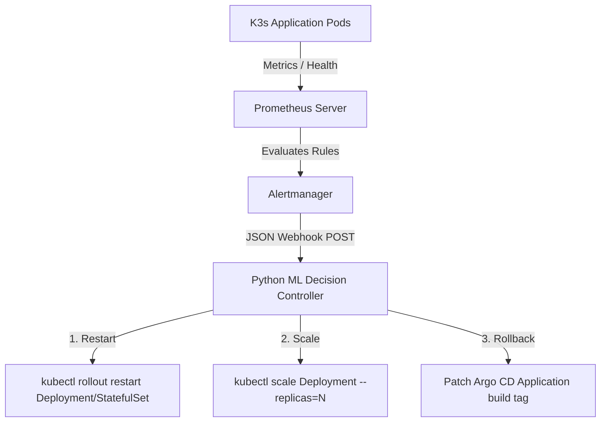

# CivicPulseAI — How to Demo Self-Healing Remediation Paths

This guide provides step-by-step instructions for demonstrating the **Intelligent Self-Healing CI/CD Platform** during a viva or live technical demonstration.

---

## 🏗️ Self-Healing Architecture Overview



---

## 🧪 Demonstration 1: Automatic Pod Restart (`RESTART`)

### Trigger Condition
Triggers when `PodCrashLooping`, `BackendHealthFailing`, or `MongoDBDown` alert fires.

### Step 1: Simulate Backend API Failure
Cause the backend `/api/health` endpoint to fail or force a pod crash loop:
```bash
# Option A: Delete backend pod repeatedly to trigger crash loop alert
kubectl delete pod -l app.kubernetes.io/component=backend -n civicpulse

# Option B: Send a POST test payload directly to Alertmanager or ML Controller
curl -X POST http://civicpulse-ml-decision-controller:5000/api/v1/alerts \
  -H "Content-Type: application/json" \
  -d '{
    "status": "firing",
    "alerts": [
      {
        "status": "firing",
        "labels": {
          "alertname": "BackendHealthFailing",
          "severity": "critical",
          "namespace": "civicpulse"
        },
        "annotations": {
          "summary": "Backend API /api/health probe failing"
        }
      }
    ]
  }'
```

### Verification
1. Check ML Decision Controller logs:
   ```bash
   kubectl logs -n civicpulse -l app.kubernetes.io/component=ml-decision-controller --tail=50
   ```
2. Verify automated rollout restart:
   ```bash
   kubectl get pods -n civicpulse -l app.kubernetes.io/component=backend -w
   ```
3. Check decisions audit endpoint:
   ```bash
   curl http://civicpulse-ml-decision-controller:5000/api/v1/decisions
   ```

---

## 📈 Demonstration 2: Automatic Replica Scaling (`SCALE`)

### Trigger Condition
Triggers when sustained high CPU or memory load (`HighCpuUsage`, `HighMemoryUsage`) fires without pod crashes.

### Step 1: Simulate High CPU Load
```bash
# Send Alertmanager payload simulating HighCpuUsage alert
curl -X POST http://civicpulse-ml-decision-controller:5000/api/v1/alerts \
  -H "Content-Type: application/json" \
  -d '{
    "status": "firing",
    "alerts": [
      {
        "status": "firing",
        "labels": {
          "alertname": "HighCpuUsage",
          "severity": "warning",
          "namespace": "civicpulse"
        },
        "annotations": {
          "summary": "High CPU usage on pod civicpulse-backend-123"
        }
      }
    ]
  }'
```

### Verification
1. Inspect deployment replica count (scaled up by +1 up to max limit of 3):
   ```bash
   kubectl get deployment civicpulse-backend -n civicpulse
   ```
2. Verify in decision audit log:
   `remediation_action: "SCALE"`, `new_replicas: 2`

---

## ⏪ Demonstration 3: Zero-Commit Rollback (`ROLLBACK`)

### Trigger Condition
Triggers when multiple critical alerts fire simultaneously (e.g. cumulative severity score >= 20) or explicit rollback signal is detected.

### Step 1: Inject Multi-Failure Alert Storm
```bash
curl -X POST http://civicpulse-ml-decision-controller:5000/api/v1/alerts \
  -H "Content-Type: application/json" \
  -d '{
    "status": "firing",
    "alerts": [
      {
        "status": "firing",
        "labels": { "alertname": "PodCrashLooping", "severity": "critical", "namespace": "civicpulse" }
      },
      {
        "status": "firing",
        "labels": { "alertname": "BackendHealthFailing", "severity": "critical", "namespace": "civicpulse" }
      },
      {
        "status": "firing",
        "labels": { "alertname": "MongoDBDown", "severity": "critical", "namespace": "civicpulse" }
      }
    ]
  }'
```

### Verification
1. Check Argo CD Application spec parameters patch:
   ```bash
   kubectl get application civicpulse -n argocd -o jsonpath='{.spec.source.helm.parameters}'
   ```
2. Observe zero-commit rollback: Argo CD reconciles back to the previous stable build tag without making any Git commits!

---

## 🛡️ Thrashing Guard & Cooldown Safety

- Each workload target enforces a **5-minute (300-second) cooldown window**.
- Subsequent duplicate alerts within 5 minutes return `cooldown_active: true`, preventing action thrashing.
